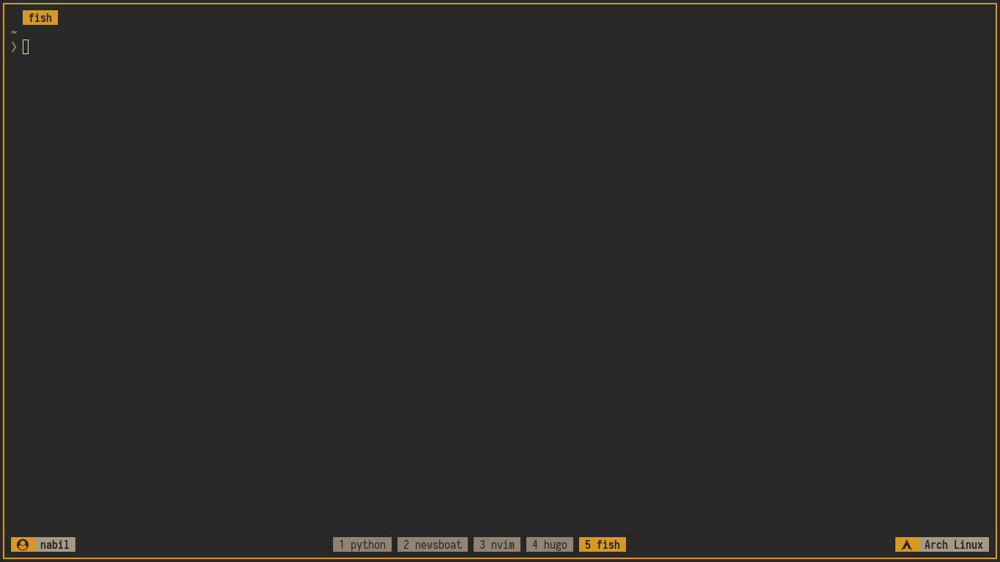

+++
draft = false
date = '2019-05-27'
title = 'Berkenalan Dengan tmux'
type = 'blog'
description = 'Pengenalan dan konfigurasi dasar tmux untuk membuka banyak sesi terminal dalam satu window.'
image = ''
tags = ['tmux']
+++

## Intro

Bayangkan bisa menjalankan banyak program sekaligus dalam satu window terminal tanpa perlu buka-tutup tab. Itulah yang ditawarkan **tmux** (Terminal Multiplexer) -- sebuah tool yang memungkinkan kita membuka banyak sesi terminal dalam satu layar. Buat saya pribadi, tmux sangat membantu terutama saat bekerja di TTY alias *the real true terminal* milik GNU/Linux.

## Permasalahan

Bagi pengguna baru, tmux seringkali terasa membingungkan. Key binding-nya yang belum familiar membuat kesan pertama jadi agak overwhelming. Padahal kalau sudah terbiasa, tmux justru menjadi salah satu investasi tools terbaik untuk meningkatkan produktivitas di terminal.

## Instalasi

Untuk pengguna Archlinux dan turunannya, cukup jalankan perintah berikut:

```
$ sudo pacman -S tmux
```

## Konfigurasi

Setelah tmux terpasang, saatnya melakukan konfigurasi agar lebih nyaman digunakan dan tampil lebih menarik. Ada dua hal yang akan kita ubah:

* Mengganti default prefix key
* Mempercantik tampilan status bar

File konfigurasi tmux berada di `~/.tmux.conf` untuk tiap user, sedangkan konfigurasi global ada di `/etc/tmux.conf`.

### Mengganti Prefix Key

Secara default, prefix key tmux menggunakan `Ctrl-b`. Misalnya, untuk membuat split horizontal kita harus menekan `Ctrl-b` lalu `%`. Masalahnya, posisi tombol `Ctrl` dan `b` cukup berjauhan sehingga agak repot kalau belum terbiasa. Solusinya, ganti prefix menjadi `Ctrl-a` yang posisinya lebih mudah dijangkau:

```
unbind C-b
set -g prefix C-a
bind C-a send-prefix
```

### Mempercantik Status Bar

Tampilan default status bar tmux cukup polos dan terkesan monoton. Dengan sedikit sentuhan konfigurasi, kita bisa membuatnya jadi lebih informatif dan enak dipandang:

```
# STATUS
set -g status-position bottom
set -g status on
set -g status-interval 60
set -g status-style "fg=brightwhite, bg=black"

## Left
set -g status-left-length 40
set -g status-left "#[fg=black,bg=yellow, bold]   #[fg=black,bg=white, bold] #(whoami) "

## Center
set -g window-status-format "#[fg=black,bg=brightblack] #I #{pane_current_command} "
set -g window-status-current-format "#[fg=black,bg=yellow, bold] #I #{pane_current_command} "
set -g window-status-separator " "
set -g status-justify centre

## Right
set -g status-right-length 40
set -g status-right "#{prefix_highlight} #[fg=black,bg=yellow, bold]   #[fg=black,bg=white, bold] #(lsb_release -d | cut -f 2) "
```

Bonus -- konfigurasi tambahan untuk pengaturan window:

```
# WINDOW
set -g base-index 1
set -g renumber-windows on
setw -g automatic-rename on
setw -g window-style "fg=white bg=black"
setw -g window-active-style "fg=brightwhite bg=black"
```

## Hasil

Setelah semua konfigurasi ditambahkan ke `.tmux.conf`, hasilnya akan terlihat seperti ini:



*PS: screenshot ini diambil dari terminal emulator, bukan langsung dari TTY -- soalnya saya belum tahu cara screenshot di TTY.*

## Referensi

- Tmux manpages (`man tmux`) -- Diakses pada 2019-05-25
- [Panduan Minimal Belajar Tmux](https://agung-setiawan.com/panduan-minimal-belajar-tmux/) -- Diakses pada 2019-05-25
- [Archwiki Tmux](https://wiki.archlinux.org/index.php/tmux) -- Diakses pada 2019-05-25
