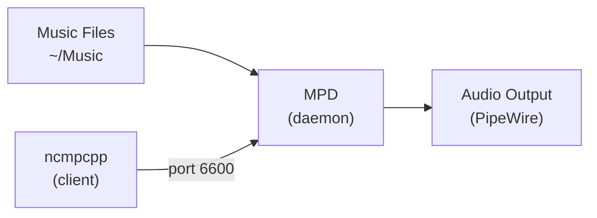

+++
draft = false
date = '2026-04-05'
title = 'Konfigurasi Mpd Dan Ncmpcpp Sebagai Music Player Di Archlinux'
type = 'blog'
description = 'Cara mengkonfigurasi MPD dan ncmpcpp sebagai music player berbasis terminal di Archlinux untuk memutar koleksi musik FLAC dengan PipeWire audio output.'
image = ''
tags = ['mpd', 'ncmpcpp', 'terminal', 'archlinux']
+++

## Latar Belakang

Saya punya koleksi musik dalam format **FLAC** (Free Lossless Audio Codec) -- format lossless yang menyimpan audio tanpa kompresi lossy, sehingga kualitas suaranya identik dengan source aslinya. Untuk memutar koleksi ini, saya butuh player yang ringan, bisa jalan di background, dan mendukung FLAC dengan baik.

Kebanyakan music player di Linux -- Spotify, Rhythmbox, Audacious -- menggunakan arsitektur monolitik: satu aplikasi yang menangani semuanya dari library management, playback, sampai UI. Pendekatan ini memang simpel, tapi kurang fleksibel. Kalau mau ganti UI, harus ganti seluruh aplikasi. Kalau mau music tetap jalan di background tanpa GUI, tidak bisa.

**MPD (Music Player Daemon)** mengambil pendekatan berbeda -- memisahkan antara **server** (daemon yang menangani playback) dan **client** (UI untuk mengontrol playback). MPD jalan di background sebagai daemon, sementara kita bebas memilih client apapun untuk mengontrolnya. MPD mendukung FLAC secara native tanpa plugin tambahan -- tinggal arahkan ke direktori musik dan langsung bisa diputar. Salah satu client terbaik untuk terminal adalah **ncmpcpp** -- client berbasis ncurses yang ringan, cepat, dan highly customizable.

Kombinasi MPD + ncmpcpp memberikan music player yang:
- Mendukung FLAC dan format lossless lainnya secara native
- Jalan di background tanpa GUI
- Bisa dikontrol dari terminal, keybinding, atau bahkan remote
- Resource usage sangat minimal
- Konfigurasi sepenuhnya lewat text file

## Permasalahan

Music player berbasis GUI seringkali overkill untuk kebutuhan yang sederhana -- putar koleksi musik FLAC lokal. Beberapa masalah yang biasa ditemui:

- **Resource hungry** -- player GUI makan RAM dan CPU yang sebenarnya tidak perlu
- **Tidak bisa jalan tanpa desktop session** -- kalau window ditutup, musik berhenti
- **Kurang integrasi dengan workflow terminal** -- harus switch ke window lain untuk skip track atau adjust volume
- **Konfigurasi terbatas** -- UI menentukan apa yang bisa dan tidak bisa di-customize

Dengan MPD, musik tetap jalan meskipun tidak ada GUI yang terbuka. Dan dengan ncmpcpp, kita punya kontrol penuh dari terminal -- termasuk custom keybinding yang sesuai dengan workflow kita.

## Pendekatan Solusi

Arsitektur MPD menggunakan model **client-server**:



MPD berjalan sebagai daemon yang listen di port `6600`, membaca file musik dari direktori yang ditentukan, dan mengirim audio output ke PipeWire. ncmpcpp terhubung ke MPD lewat port tersebut untuk mengontrol playback.

Keuntungan arsitektur ini:

- **MPD dan client terpisah** -- musik tetap jalan meskipun ncmpcpp ditutup
- **Multiple client** -- bisa kontrol MPD dari ncmpcpp, mpc (command line), atau bahkan dari HP lewat client Android
- **Audio output fleksibel** -- bisa ke PipeWire, ALSA langsung, atau bahkan ke DAC eksternal

## Implementasi Teknis

### Instalasi

Install MPD dan ncmpcpp dari repository resmi:

```
$ sudo pacman -S mpd ncmpcpp
```

### Konfigurasi MPD

Buat direktori untuk data MPD:

```
$ mkdir -p ~/.local/share/mpd/playlists
```

Buat file konfigurasi `~/.config/mpd/mpd.conf`:

```ini
#
# Servers #
#
bind_to_address    "127.0.0.1"
auto_update        "yes"
db_file            "~/.local/share/mpd/database"
log_file           "~/.local/share/mpd/log"
pid_file           "~/.local/share/mpd/pid"
port               "6600"
state_file         "~/.local/share/mpd/state"

#
# Directory #
#
music_directory    "~/Music"
playlist_directory "~/.local/share/mpd/playlists"

#
# Other's #
#
filesystem_charset "UTF-8"


#
# Audio Output #
# to get audio type use this command $ aplay --list-pcm
#

audio_output {
    type   "pipewire"
    name   "PipeWire Sound Server"
    device "pipewire"
}
```

Penjelasan parameter penting:

| Parameter | Fungsi |
|-----------|--------|
| `bind_to_address` | MPD hanya listen di localhost -- aman dari akses luar |
| `auto_update` | Otomatis scan ulang music directory kalau ada file baru |
| `music_directory` | Direktori tempat koleksi musik disimpan |
| `state_file` | Menyimpan state playback (posisi track, volume) agar persist setelah restart |
| `audio_output` | Output audio ke PipeWire -- audio server modern yang menggantikan PulseAudio |

Untuk audio output, kita menggunakan **PipeWire** yang sudah jadi default di kebanyakan distro modern. Jika menggunakan DAC eksternal via ALSA langsung (bypass PipeWire), bisa tambahkan output alternatif:

```ini
# audio_output {
#   type "alsa"
#   name "Shanling UA4"
#   device "iec958:CARD=UA4,DEV=0"
#   mixer_control "PCM"
# }
```

Untuk mengetahui device ALSA yang tersedia, gunakan:

```
$ aplay --list-pcm
```

### Menjalankan MPD

MPD dijalankan sebagai user service (bukan system service) agar berjalan dalam konteks user dan bisa mengakses PipeWire audio session:

```
$ systemctl --user enable --now mpd
```

Verifikasi MPD berjalan:

```
$ systemctl --user status mpd
```

### Konfigurasi ncmpcpp

Buat file konfigurasi `~/.config/ncmpcpp/config`:

```ini
[global]
allow_for_physical_item_deletion            = yes
autocenter_mode                             = yes
centered_cursor                             = yes
colors_enabled                              = yes
enable_window_title                         = yes
external_editor                             = nvim
header_visibility                           = no
ignore_leading_the                          = yes
message_delay_time                          = 1
song_window_title_format                    = "{%a - }{%t}|{%f}"
titles_visibility                           = no

[mpd]
mpd_connection_timeout                      = 5
mpd_crossfade_time                          = 2
mpd_host                                    = 127.0.0.1
mpd_music_dir                               = ~/Music
mpd_port                                    = 6600

[playlist]
playlist_display_mode                       = columns
song_columns_list_format                    = "(50)[white]{ar} (50)[white]{t}"

[statusbar]
display_bitrate                             = yes
display_remaining_time                      = no
progressbar_look                            = "━━━"
progressbar_color = white
progressbar_elapsed_color = green
song_status_format                          = "{$b$3%t$/b $8by $b$4%a$8$/b}|{%f}"
statusbar_visibility                        = yes

[lyrics]
fetch_lyrics_for_current_song_in_background = no
follow_now_playing_lyrics                   = no
store_lyrics_in_song_dir                    = no
```

Beberapa highlight konfigurasi:

- **`autocenter_mode` dan `centered_cursor`** -- cursor selalu di tengah layar, navigasi terasa lebih nyaman di playlist yang panjang
- **`header_visibility = no` dan `titles_visibility = no`** -- menyembunyikan header dan title bar untuk tampilan yang lebih clean
- **`playlist_display_mode = columns`** -- menampilkan playlist dalam format kolom (artist | title) yang lebih rapi
- **`song_columns_list_format`** -- format kolom playlist: 50% untuk artist, 50% untuk title
- **`progressbar_look = "━━━"`** -- progress bar dengan karakter garis tebal
- **`mpd_crossfade_time = 2`** -- crossfade 2 detik antar track untuk transisi yang mulus
- **`display_bitrate = yes`** -- menampilkan bitrate di statusbar, berguna untuk memastikan file FLAC diputar dengan bitrate yang benar (biasanya 800-1400 kbps untuk FLAC 16-bit/44.1kHz)
- **`external_editor = nvim`** -- menggunakan Neovim untuk edit tag musik

### Custom Keybinding

Buat file `~/.config/ncmpcpp/bindings` untuk keybinding ala Vim:

```
def_key "D"
    delete_playlist_items
def_key "D"
    delete_browser_items
def_key "D"
    delete_stored_playlist

def_key "k"
    scroll_up
def_key "K"
    select_item
    scroll_up

def_key "j"
    scroll_down
def_key "J"
    select_item
    scroll_down

def_key "l"
    enter_directory
def_key "l"
    play_item

def_key "h"
    jump_to_parent_directory

def_key "d"
    delete_playlist_items

def_key "n"
    next_found_item
def_key "N"
    previous_found_item

def_key "L"
    show_lyrics
```

Keybinding ini mengganti navigasi default dengan pola **hjkl** ala Vim:

| Key | Fungsi |
|-----|--------|
| `h` | Naik ke parent directory |
| `j` / `k` | Scroll bawah / atas |
| `J` / `K` | Select item + scroll (untuk multi-select) |
| `l` | Masuk directory atau play item |
| `d` / `D` | Hapus item dari playlist |
| `n` / `N` | Next / previous search result |
| `L` | Tampilkan lirik |

### Menjalankan ncmpcpp

Cukup jalankan dari terminal:

```
$ ncmpcpp
```

Beberapa keybinding bawaan yang sering dipakai:

| Key | Fungsi |
|-----|--------|
| `1` - `8` | Switch antar view (playlist, browser, search, dll) |
| `p` | Pause/play |
| `s` | Stop |
| `>` / `<` | Next / previous track |
| `+` / `-` | Volume up / down |
| `r` | Toggle repeat |
| `z` | Toggle random |
| `u` | Update database |
| `/` | Search |

## Tantangan yang Dihadapi

Tantangan pertama adalah soal **permission audio output**. MPD harus dijalankan sebagai user service (`systemctl --user`), bukan system service. Kalau dijalankan sebagai system service, MPD berjalan dalam konteks root dan tidak bisa mengakses PipeWire audio session milik user -- hasilnya tidak ada suara meskipun MPD terlihat playing.

Tantangan kedua adalah **database tidak otomatis ter-build saat pertama kali**. Setelah konfigurasi selesai dan MPD dijalankan, koleksi musik mungkin belum muncul di ncmpcpp. Tekan `u` di ncmpcpp untuk trigger database update, atau jalankan:

```
$ mpc update
```

Pastikan juga file FLAC berada di direktori yang ditentukan di `music_directory`.

## Insight dan Pembelajaran

Setelah menggunakan MPD + ncmpcpp, beberapa insight:

- **Arsitektur client-server itu powerful** -- musik tetap jalan meskipun ncmpcpp ditutup. Bisa buka tutup client kapan saja tanpa mengganggu playback. Bahkan bisa kontrol MPD dari script atau keybinding window manager.
- **Resource usage sangat minimal** -- MPD idle menggunakan memory yang sangat kecil. Dibanding Spotify atau music player GUI, perbedaannya signifikan.
- **Keybinding Vim-style bikin navigasi cepat** -- dengan custom binding hjkl, navigasi koleksi musik terasa natural buat yang sudah terbiasa dengan Vim.
- **`auto_update` menghilangkan friction** -- tidak perlu manual update database setiap kali menambah file musik baru. MPD otomatis mendeteksi perubahan di music directory.
- **PipeWire sebagai audio output simpel dan reliable** -- tidak perlu konfigurasi rumit seperti ALSA langsung. Cukup set type `pipewire` dan selesai.

## Penutup

MPD + ncmpcpp adalah kombinasi yang ideal untuk memutar koleksi musik FLAC dari terminal. MPD menangani playback di background dengan resource minimal, sementara ncmpcpp memberikan interface yang cepat dan customizable. Dengan konfigurasi yang sepenuhnya berbasis text file, setup ini mudah di-backup, di-share, dan di-reproduce di mesin lain. Untuk yang menghabiskan banyak waktu di terminal dan punya koleksi musik FLAC, setup ini layak dicoba.

## Referensi

- [Arch Wiki - Music Player Daemon](https://wiki.archlinux.org/title/Music_Player_Daemon) -- Diakses pada 2026-04-05
- [Arch Wiki - ncmpcpp](https://wiki.archlinux.org/title/Ncmpcpp) -- Diakses pada 2026-04-05
- [MPD Documentation](https://mpd.readthedocs.io/) -- Diakses pada 2026-04-05
- [ncmpcpp GitHub](https://github.com/ncmpcpp/ncmpcpp) -- Diakses pada 2026-04-05
