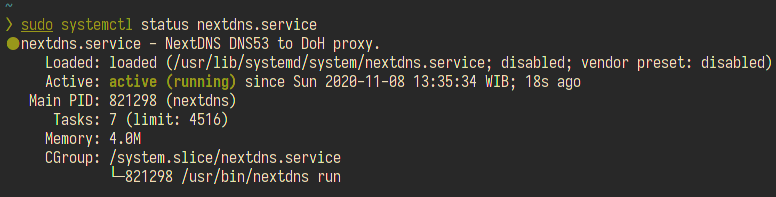
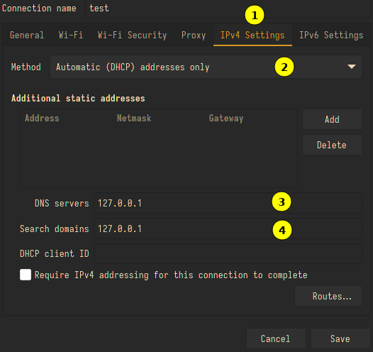

+++
draft = false
date = '2020-11-08'
title = 'Konfigurasi Nextdns Client Di Archlinux'
type = 'blog'
description = 'Cara mengimplementasikan NextDNS sebagai DNS firewall untuk keamanan berselancar di internet pada Archlinux.'
image = ''
tags = ['nextdns', 'dns', 'blockads']
+++

Kali ini saya mencoba mengimplementasikan **NextDNS** sebagai alternatif dari dnscrypt yang selama ini saya gunakan. NextDNS adalah layanan DNS firewall yang bertujuan meningkatkan keamanan saat berselancar di internet. Tidak hanya itu, NextDNS juga menawarkan perlindungan dari berbagai ancaman -- mulai dari memblokir iklan yang mengganggu, mencegah pelacakan oleh situs web, dan masih banyak lagi.

## Instalasi

Ada beberapa service yang bisa digunakan untuk mengintegrasikan NextDNS ke sistem, di antaranya:

* **nextdns-client** -- client resmi dari NextDNS
* **systemd-resolved** -- resolver DNS bawaan systemd
* **dnscrypt-proxy** -- proxy DNS terenkripsi

### Menggunakan NextDNS Client

Untuk pengguna Archlinux, nextdns-client tersedia di AUR (Arch User Repository). Install dengan perintah berikut:

```
$ yay -S nextdns
```


Setelah terinstall, aktifkan service-nya:

```
$ sudo systemctl start nextdns
```

Pastikan service sudah berjalan dengan baik:

```
$ sudo systemctl status nextdns
```



Setelah service aktif, langkah selanjutnya adalah memasukkan NextDNS ID. Caranya:

* Buka [my.nextdns.io](https://my.nextdns.io) dan salin NextDNS ID-mu (lihat gambar di bawah)

  

* Jalankan perintah berikut dengan mengganti `<nextdns-id>` menggunakan ID yang sudah disalin:

  ```
  $ sudo nextdns install -config <nextdns-id> -setup-router
  ```

## Uji Coba

Buka network manager yang digunakan -- sebagai contoh, di sini saya menggunakan **NetworkManager**. Masukkan `127.0.0.1` di bagian DNS server dan search domain.



Alternatif lainnya, kamu bisa langsung mengubah file `/etc/resolv.conf` dan set alamat DNS-nya ke `127.0.0.1`.

Langkah terakhir, coba ping ke salah satu domain untuk memastikan konfigurasi sudah benar:


## Kesimpulan

* **Kelebihan**
  * Instalasi mudah, tidak perlu konfigurasi manual yang rumit
  * Resource yang dibutuhkan sangat ringan
* **Kekurangan**
  * Ada limitasi 300 ribu query per bulan untuk paket gratis -- lebih dari itu perlu upgrade ke paket berbayar

## Referensi

* [NextDNS Wiki](https://github.com/nextdns/nextdns/wiki) -- Diakses pada 2020-11-08
