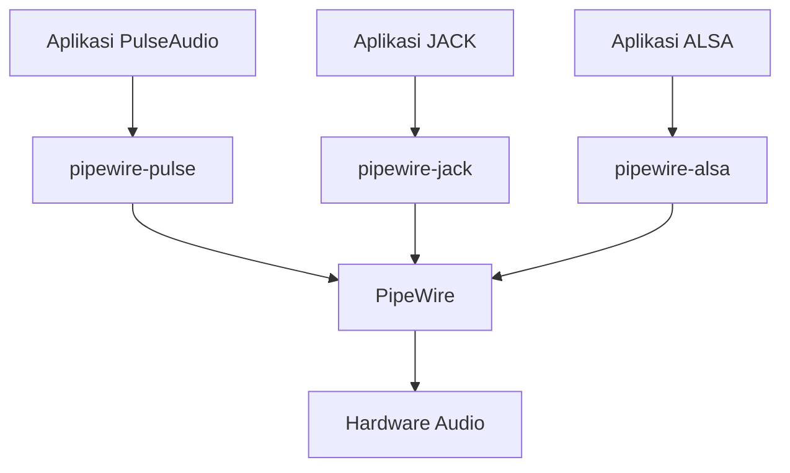

+++
draft = false
date = '2026-04-05'
title = 'Konfigurasi Pipewire Menggantikan Pulseaudio Di Archlinux'
type = 'blog'
description = 'Cara migrasi dari PulseAudio ke PipeWire di Archlinux untuk memutar koleksi musik FLAC dengan kualitas lossless dan konfigurasi audio yang optimal.'
image = ''
tags = ['pipewire', 'audio', 'flac', 'lossless', 'archlinux']
+++

## Latar Belakang

Saya punya koleksi musik dalam format **FLAC** -- format lossless yang menyimpan audio tanpa kompresi lossy. Untuk menikmati koleksi ini dengan kualitas optimal, audio server yang digunakan juga harus mampu memproses audio tanpa degradasi. Masalahnya, **PulseAudio** secara default melakukan resampling ke sample rate dan format tertentu, yang bisa menurunkan kualitas audio lossless.

**PipeWire** hadir sebagai pengganti PulseAudio (dan sekaligus JACK) yang lebih modern. Selain mendukung low-latency audio layaknya JACK dan menangani video (screen sharing di Wayland), PipeWire juga bisa dikonfigurasi untuk **passthrough audio tanpa resampling** -- artinya file FLAC 24-bit/96kHz diputar apa adanya ke DAC tanpa konversi. Singkatnya, satu framework yang menangani semuanya dengan kualitas audio yang lebih baik.

## Permasalahan

Beberapa masalah yang sering muncul dengan PulseAudio, terutama untuk kebutuhan lossless audio:

- **Resampling otomatis** -- PulseAudio secara default melakukan resampling semua audio ke sample rate yang sama (biasanya 44.1kHz atau 48kHz). File FLAC 24-bit/96kHz akan di-downsample, menghilangkan detail audio yang seharusnya tersimpan di format lossless
- **Format conversion** -- PulseAudio mengkonversi audio ke format internal (biasanya S16LE atau FLOAT32LE) yang belum tentu sesuai dengan kemampuan DAC
- **Latency yang kurang ideal** -- untuk kebutuhan audio production atau monitoring real-time, latency PulseAudio masih terlalu tinggi
- **Tidak bisa menggantikan JACK** -- kalau butuh low-latency audio (real-time effects), harus install JACK terpisah yang konfigurasinya cukup rumit dan sering bentrok dengan PulseAudio
- **Bluetooth audio terbatas** -- dukungan codec Bluetooth di PulseAudio kurang lengkap dibanding PipeWire

Yang dibutuhkan adalah audio server yang bisa memutar koleksi FLAC dengan kualitas bit-perfect -- tanpa resampling atau konversi format yang tidak perlu.

## Pendekatan Solusi

PipeWire menyelesaikan masalah ini dengan pendekatan **compatibility layer**:



PipeWire menyediakan compatibility layer untuk setiap audio API:

| Layer | Fungsi |
|-------|--------|
| `pipewire-pulse` | Menggantikan PulseAudio server -- aplikasi yang menggunakan PulseAudio API tetap berjalan tanpa modifikasi |
| `pipewire-jack` | Menggantikan JACK -- aplikasi JACK bisa langsung terhubung ke PipeWire |
| `pipewire-alsa` | Mengarahkan aplikasi ALSA langsung ke PipeWire |

Artinya, **semua aplikasi yang sudah ada tetap berjalan** -- mereka tidak tahu bahwa di balik layar sudah bukan PulseAudio lagi. Migrasi bisa dilakukan tanpa perlu mengubah konfigurasi aplikasi apapun.

Session management ditangani oleh **WirePlumber** -- session manager default untuk PipeWire yang mengelola routing audio antar device dan aplikasi.

## Implementasi Teknis

### Instalasi

Install PipeWire beserta compatibility layer-nya:

```
$ sudo pacman -S pipewire pipewire-pulse pipewire-alsa pipewire-jack wireplumber
```

Penjelasan masing-masing package:

| Package | Fungsi |
|---------|--------|
| `pipewire` | Core PipeWire daemon |
| `pipewire-pulse` | PulseAudio compatibility layer -- menggantikan `pulseaudio` |
| `pipewire-alsa` | ALSA compatibility -- mengarahkan ALSA clients ke PipeWire |
| `pipewire-jack` | JACK compatibility -- menggantikan `jack2` |
| `wireplumber` | Session manager yang mengelola routing dan policy |

Saat install `pipewire-pulse`, pacman akan otomatis menampilkan opsi untuk menghapus `pulseaudio` dan `pulseaudio-bluetooth` karena pipewire dan pulseaudio saling conflict sehingga tidak bisa diinstall disatu device yang sama.

### Menghapus PulseAudio

Jika PulseAudio masih terinstall dan belum otomatis terhapus:

```
$ sudo pacman -Rns pulseaudio pulseaudio-bluetooth
```

Pastikan juga PulseAudio service tidak berjalan:

```
$ systemctl --user stop pulseaudio.socket pulseaudio.service
$ systemctl --user disable pulseaudio.socket pulseaudio.service
```

### Mengaktifkan PipeWire

PipeWire dan WirePlumber dijalankan sebagai user service:

```
$ systemctl --user enable --now pipewire pipewire-pulse wireplumber
```

Verifikasi semua service berjalan:

```
$ systemctl --user status pipewire pipewire-pulse wireplumber
```

### Verifikasi

Cek apakah PipeWire sudah menggantikan PulseAudio:

```
$ pactl info | grep "Server Name"
Server Name: PulseAudio (on PipeWire 1.x.x)
```

Jika output menampilkan `PulseAudio (on PipeWire)`, berarti migrasi berhasil. Semua aplikasi yang menggunakan PulseAudio API sekarang berkomunikasi dengan PipeWire.

Cek audio devices yang terdeteksi:

```
$ wpctl status
```

Output akan menampilkan audio sinks (output), sources (input), dan routing yang aktif. Ini adalah cara utama untuk melihat state audio di PipeWire.

Test playback audio:

```
$ speaker-test -c 2
```

### Mengatur Default Audio Device

Untuk melihat daftar audio sink (output device):

```
$ wpctl status
```

Cari ID device yang diinginkan di bagian "Sinks", lalu set sebagai default:

```
$ wpctl set-default <ID>
```

### Mengatur Volume

```
$ wpctl set-volume @DEFAULT_AUDIO_SINK@ 0.5      # Set volume ke 50%
$ wpctl set-volume @DEFAULT_AUDIO_SINK@ 5%+       # Naikkan 5%
$ wpctl set-volume @DEFAULT_AUDIO_SINK@ 5%-       # Turunkan 5%
$ wpctl set-mute @DEFAULT_AUDIO_SINK@ toggle      # Toggle mute
```

Command `wpctl` ini bisa di-bind ke keybinding window manager untuk kontrol volume dari keyboard.

### Bluetooth Audio

Untuk Bluetooth audio, install package tambahan:

```
$ sudo pacman -S libspa-bluetooth
```

Restart PipeWire setelah install:

```
$ systemctl --user restart pipewire pipewire-pulse
```

PipeWire mendukung codec Bluetooth yang lebih lengkap dibanding PulseAudio, termasuk **AAC**, **aptX**, **aptX HD**, **LDAC**, dan **LC3** (Bluetooth LE Audio).

### Konfigurasi Lossless Audio untuk FLAC

Secara default, PipeWire sudah lebih baik dari PulseAudio dalam menangani audio lossless. Tapi untuk memastikan koleksi FLAC diputar dengan kualitas optimal, ada beberapa parameter yang perlu dikonfigurasi.

Buat file `~/.config/pipewire/pipewire.conf.d/lossless.conf`:

```
context.properties = {
    default.clock.allowed-rates = [ 44100 48000 88200 96000 176400 192000 ]
}
```

Parameter `default.clock.allowed-rates` mendefinisikan sample rate yang diizinkan. Dengan konfigurasi ini, PipeWire akan otomatis menyesuaikan sample rate sesuai dengan file yang sedang diputar. File FLAC 44.1kHz diputar di 44.1kHz, file 96kHz diputar di 96kHz -- **tanpa resampling**.

Jika tidak di-set, PipeWire akan menggunakan satu sample rate tetap (biasanya 48kHz) dan melakukan resampling untuk semua audio yang tidak sesuai. Dengan konfigurasi di atas, resampling hanya terjadi jika sample rate file tidak ada dalam daftar -- yang sangat jarang untuk koleksi FLAC.

Restart PipeWire setelah konfigurasi:

```
$ systemctl --user restart pipewire pipewire-pulse
```

Verifikasi sample rate yang aktif:

```
$ pw-metadata -n settings
```

Untuk mengecek apakah sample rate berubah sesuai file yang diputar, jalankan perintah di atas sambil memutar file FLAC dengan sample rate berbeda -- nilainya seharusnya berubah mengikuti file.

## Tantangan yang Dihadapi

Tantangan pertama adalah memastikan **semua service PulseAudio benar-benar berhenti** sebelum mengaktifkan PipeWire. Kalau `pulseaudio.socket` masih aktif, ia bisa otomatis men-spawn PulseAudio server yang bentrok dengan PipeWire di port yang sama. Hasilnya tidak ada suara atau audio yang terputus-putus.

Tantangan kedua terkait **aplikasi yang hardcode path PulseAudio**. Sebagian besar aplikasi tidak bermasalah karena `pipewire-pulse` mengekspos API yang identik. Tapi beberapa aplikasi lama mungkin menyimpan konfigurasi di `~/.config/pulse/` yang bisa menyebabkan perilaku aneh. Jika ada masalah, coba rename atau hapus direktori tersebut:

```
$ mv ~/.config/pulse ~/.config/pulse.bak
```

Satu hal lagi -- jika menggunakan `pavucontrol` (PulseAudio Volume Control) sebagai GUI mixer, tool ini tetap bisa dipakai karena berkomunikasi lewat PulseAudio API yang sudah di-handle oleh `pipewire-pulse`.

## Insight dan Pembelajaran

Beberapa insight setelah migrasi dari PulseAudio ke PipeWire:

- **Migrasi hampir seamless** -- karena `pipewire-pulse` mengekspos API yang sama, semua aplikasi langsung berjalan tanpa perubahan konfigurasi apapun. Ini yang bikin migrasi ke PipeWire sangat low risk.
- **Lossless audio tanpa resampling itu game changer** -- dengan `default.clock.allowed-rates`, PipeWire otomatis switch sample rate sesuai file FLAC yang diputar. Tidak perlu lagi khawatir koleksi 96kHz di-downsample ke 48kHz.
- **Latency jauh lebih rendah** -- terasa perbedaannya saat monitoring audio real-time atau menggunakan DAW. PipeWire bisa mencapai latency setara JACK tanpa konfigurasi khusus.
- **`wpctl` adalah tool utama** -- untuk troubleshooting dan manajemen audio sehari-hari, `wpctl status` dan `wpctl set-default` adalah command yang paling sering dipakai.
- **Bluetooth audio lebih reliable** -- switching antara profile A2DP (music) dan HFP (headset/mic) lebih mulus dibanding di PulseAudio. Dukungan codec tambahan seperti LDAC juga langsung tersedia.
- **Screen sharing di Wayland langsung berfungsi** -- karena PipeWire juga menangani video stream, screen sharing di browser (Firefox, Chromium) dan aplikasi seperti OBS langsung bekerja di Wayland tanpa konfigurasi tambahan.

## Penutup

Migrasi dari PulseAudio ke PipeWire di Archlinux adalah salah satu upgrade yang paling painless. Install beberapa package, enable service, dan semua aplikasi langsung bekerja seperti sebelumnya -- tapi dengan kualitas audio yang lebih baik untuk koleksi FLAC. Dengan konfigurasi `allowed-rates`, PipeWire memastikan file lossless diputar tanpa resampling yang tidak perlu. Untuk yang punya koleksi musik FLAC dan peduli dengan kualitas audio, migrasi ke PipeWire sangat direkomendasikan.

## Referensi

- [Arch Wiki - PipeWire](https://wiki.archlinux.org/title/PipeWire) -- Diakses pada 2026-04-05
- [Arch Wiki - WirePlumber](https://wiki.archlinux.org/title/WirePlumber) -- Diakses pada 2026-04-05
- [PipeWire Documentation](https://docs.pipewire.org/) -- Diakses pada 2026-04-05
- [PipeWire GitLab](https://gitlab.freedesktop.org/pipewire/pipewire) -- Diakses pada 2026-04-05
