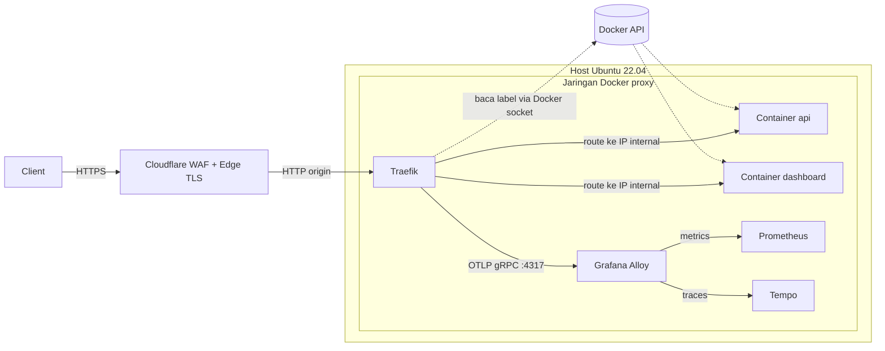

+++
draft = false
date = '2026-08-15'
title = 'Konfigurasi Traefik sebagai API Gateway dengan Telemetry OpenTelemetry di Ubuntu Server'
type = 'blog'
description = 'Menjalankan Traefik sebagai container gateway yang auto-routing lewat label Docker, sekaligus mengalirkan metrics dan tracing ke Grafana Alloy di Ubuntu Server 22.04'
image = ''
tags = ['traefik', 'opentelemetry', 'grafana-alloy', 'docker', 'observability', 'ubuntu', 'api-gateway']
+++

## Latar Belakang

Beberapa waktu terakhir saya mengelola satu server yang menampung banyak service kecil, semuanya jalan sebagai container Docker. Ada beberapa API, satu dashboard internal, dan beberapa worker yang kadang butuh diekspos lewat HTTP. Setiap kali ada service baru, saya harus menyentuh konfigurasi reverse proxy secara manual, nambah block server di Nginx, atur upstream, reload, cek lagi. Lama-lama ritual ini jadi beban tersendiri.

Yang bikin repot bukan cuma nambah routing. Setiap perubahan port container atau nama service berarti saya harus balik lagi ke file konfigurasi proxy dan menyesuaikan. Konfigurasi routing dan definisi container jadi terpisah di dua tempat, dan dua tempat itu gampang sekali jadi tidak sinkron.

Di sisi lain, observabilitynya nyaris kosong. Saya tidak punya gambaran berapa banyak request yang masuk ke tiap service, berapa yang error, atau seberapa lama latencynya. Kalau ada yang lambat, saya baru sadar setelah ada yang komplain, bukan dari data. Saya butuh gateway yang routingnya ngikut definisi container secara otomatis, sekaligus bisa ngasih metrics dan tracing tanpa harus nambah instrumentasi manual di tiap service.

## Permasalahan

- **Routing manual dan gampang tidak sinkron**, tiap service baru butuh edit config proxy terpisah dari definisi containernya, dan dua sumber ini sering beda.
- **Perubahan container tidak otomatis kebaca proxy**, ganti port atau nama service berarti harus edit ulang konfigurasi reverse proxy secara manual.
- **Minim observability**, tidak ada metrics jumlah request, error rate, atau latency per service, jadi masalah baru ketahuan setelah kejadian.
- **Instrumentasi tracing mahal kalau per service**, nambah kode tracing di tiap aplikasi butuh effort besar, apalagi untuk service yang tidak saya tulis sendiri.
- **Proxy pengennya satu stack dengan container lain**, biar gateway, aplikasi, dan tooling observability dikelola lewat satu `docker compose`, bukan tercecer antara host dan Docker.
- **HTTPS dan proteksi masih jadi PR terpisah**, tiap domain butuh sertifikat TLS yang harus diurus perpanjangannya, dan tidak ada lapisan yang menyaring trafik jahat sebelum sampai ke origin.

## Pendekatan Solusi

Saya mempertimbangkan beberapa opsi untuk kombinasi gateway dan telemetry.

| Pendekatan                                    | Kelebihan                                                                                    | Kekurangan                                                                                                         |
| --------------------------------------------- | -------------------------------------------------------------------------------------------- | ------------------------------------------------------------------------------------------------------------------ |
| **Nginx + config manual + exporter terpisah** | Familiar, stabil, dokumentasi melimpah                                                       | Routing manual, butuh exporter dan modul tambahan untuk metrics, tracing hampir tidak ada tanpa modul pihak ketiga |
| **Traefik dengan Docker provider**            | Auto-routing dari label container, metrics dan tracing OTLP sudah built-in, dashboard bawaan | Perlu akses ke Docker socket, yang punya implikasi keamanan                                                        |
| **Kong / API gateway penuh**                  | Fitur API management lengkap (auth, rate limit, plugin)                                      | Overkill untuk kebutuhan saya, butuh database, konfigurasi lebih berat                                             |

Saya pilih **Traefik**. Alasan utamanya, Traefik punya konsep **provider**, salah satunya Docker provider, yang membaca daftar container langsung dari Docker API. Routing tidak lagi ditulis di file terpisah, tapi ditempel sebagai label di `docker-compose.yml` tiap service. Definisi container dan definisi routing jadi satu tempat, jadi tidak ada lagi dua sumber yang bisa beda.

Yang bikin makin pas, Traefik v3 sudah bawa dukungan **OpenTelemetry (OTel)** secara native, baik untuk metrics maupun tracing, lewat protokol **OTLP**. Sebagai penerima telemetry saya pakai **Grafana Alloy**, sebuah collector serba guna dari Grafana yang bisa menerima OTLP lalu meneruskannya ke berbagai backend. Saya tinggal arahkan Traefik ke satu instance Alloy, dan semua request yang lewat gateway otomatis punya metrics dan trace, tanpa nambah kode instrumentasi di service mana pun.

Traefik sendiri saya jalankan sebagai container dalam satu stack `docker compose` bareng aplikasi dan tooling observability. Dengan begitu semua komponen berada di satu jaringan Docker, gateway bisa menjangkau container lain lewat nama service, dan seluruh stack bisa dinaikkan atau diturunkan dalam satu perintah.

Untuk sisi HTTPS dan proteksi, saya taruh **Cloudflare** di paling depan sebagai edge. Cloudflare menangani terminasi TLS publik, jadi sertifikat untuk pengunjung dikelola otomatis di edge tanpa saya urus perpanjangannya, sekaligus menjalankan **WAF (Web Application Firewall)** untuk menyaring trafik jahat sebelum sampai ke origin. Karena HTTPS beres di edge, Traefik di origin cukup melayani HTTP polos di port 80, tanpa sertifikat dan tanpa entrypoint 443. Konsekuensinya jalur Cloudflare ke origin tidak terenkripsi, jadi origin wajib dikunci supaya hanya menerima koneksi dari Cloudflare.

## Implementasi Teknis

Setup ini berjalan di Ubuntu Server 22.04. Asumsinya Docker dan Docker Compose sudah terpasang dan berjalan. Traefik, aplikasi, dan Grafana Alloy semuanya jalan sebagai container dalam satu jaringan Docker bernama `proxy`. Gambaran alurnya seperti ini.



Cloudflare berada paling depan sebagai edge, menerima trafik pengunjung lewat HTTPS dan menyaringnya dengan WAF, lalu meneruskannya ke origin lewat HTTP. Traefik jadi pintu masuk di sisi origin, dengan hanya port 80 yang di-publish ke host karena HTTPSnya sudah beres di edge. Ia membaca daftar container lewat Docker socket, merutekan request ke IP internal container di jaringan yang sama, lalu mengalirkan metrics dan tracing tiap request ke Alloy dalam satu koneksi OTLP.

### Menyiapkan Jaringan Docker

Semua komponen harus berada di satu jaringan supaya Traefik bisa menjangkau container lain. Saya buat jaringan `proxy` sebagai jaringan eksternal, artinya dibuat sekali di luar file compose dan dipakai bersama oleh beberapa stack.

```bash
$ docker network create proxy
$ docker network ls | grep proxy
```

Perintah pertama membuat jaringan bridge bernama `proxy`, dan perintah kedua memverifikasi jaringan itu sudah ada. Jaringan ini yang akan dirujuk sebagai `external: true` di semua file compose berikutnya.

### Konfigurasi Statis Traefik

Traefik memisahkan konfigurasi jadi dua, **konfigurasi statis** yang dibaca sekali saat start (entrypoint, provider, telemetry) dan **konfigurasi dinamis** yang bisa berubah runtime (routing dari label). Konfigurasi statis saya taruh di file `traefik.yml` yang nanti di-mount ke dalam container.

```yaml
entryPoints:
  web:
    address: ":80"
    forwardedHeaders:
      trustedIPs:
        - "173.245.48.0/20"
        - "103.21.244.0/22"
        - "2400:cb00::/32"
        # lengkapi dengan seluruh rentang IP publik Cloudflare

providers:
  docker:
    endpoint: "unix:///var/run/docker.sock"
    exposedByDefault: false
    network: proxy

api:
  dashboard: true

metrics:
  otlp:
    grpc:
      endpoint: "alloy:4317"
      insecure: true
    addEntryPointsLabels: true
    addRoutersLabels: true
    addServicesLabels: true

tracing:
  otlp:
    grpc:
      endpoint: "alloy:4317"
      insecure: true

log:
  level: INFO

accessLog: {}
```

Perhatikan hanya ada satu entrypoint, `web` di port 80. Karena terminasi TLS sepenuhnya ditangani Cloudflare di edge, origin cukup melayani HTTP polos dan tidak perlu entrypoint `websecure` di port 443 maupun sertifikat apa pun. Blok `forwardedHeaders.trustedIPs` bikin Traefik mempercayai header IP asli hanya kalau request datang dari rentang IP Cloudflare, ini yang mengembalikan IP pengunjung sebenarnya di access log, dibahas lebih lanjut di bagian Tantangan.

`providers.docker` mengaktifkan Docker provider dengan `exposedByDefault: false`, artinya container tidak akan diekspos kecuali diberi label secara eksplisit, ini penting supaya tidak ada service yang tidak sengaja terbuka. `network: proxy` memberi tahu Traefik jaringan Docker mana yang dipakai untuk menjangkau container.

Blok `metrics.otlp` dan `tracing.otlp` inilah inti telemetrynya. Keduanya mengarah ke `alloy:4317`. Karena Traefik dan Alloy ada di jaringan Docker yang sama, endpointnya cukup pakai nama service Docker, tidak perlu alamat IP host. Opsi `addEntryPointsLabels`, `addRoutersLabels`, dan `addServicesLabels` bikin metrics dipecah per entrypoint, router, dan service, jadi saya bisa lihat statistik per rute, bukan cuma agregat. `insecure: true` dipakai karena Alloynya masih di jaringan internal tanpa TLS.

### Menjalankan Traefik sebagai Container

Traefik saya definisikan di `docker-compose.yml`. Container ini cuma publish port 80, mount Docker socket supaya bisa membaca container lain, dan mount file konfigurasi statis.

```yaml
services:
  traefik:
    image: traefik:v3.3.1
    restart: unless-stopped
    ports:
      - "80:80"
    volumes:
      - /var/run/docker.sock:/var/run/docker.sock:ro
      - ./traefik.yml:/etc/traefik/traefik.yml:ro
    networks:
      - proxy

networks:
  proxy:
    external: true
```

Hanya port 80 yang di-publish, karena origin tidak melayani HTTPS sama sekali. Docker socket di-mount dengan flag `:ro` (read-only) supaya Traefik hanya bisa membaca, tidak mengubah, state Docker. File `traefik.yml` di-mount ke path default yang dibaca Traefik, jadi tidak perlu argumen command tambahan. `restart: unless-stopped` memastikan gateway naik lagi otomatis setelah reboot atau crash.

```bash
$ docker compose up -d traefik
$ docker compose logs -f traefik
```

Perintah pertama menjalankan Traefik di background, dan lognya dipantau untuk memastikan provider Docker terbaca dan tidak ada error saat konek ke Alloy.

### Menyiapkan Grafana Alloy

Grafana Alloy jalan sebagai container di jaringan yang sama. Berbeda dari collector lain yang pakai YAML, Alloy punya bahasa konfigurasi sendiri berbasis komponen, tiap komponen punya input dan output yang saling disambung lewat referensi. Konfigurasinya menerima OTLP dari Traefik lalu meneruskan metrics ke Prometheus lewat remote write dan tracing ke Tempo. Ini file `config.alloy`.

```alloy
otelcol.receiver.otlp "default" {
  grpc {
    endpoint = "0.0.0.0:4317"
  }

  output {
    metrics = [otelcol.processor.batch.default.input]
    traces  = [otelcol.processor.batch.default.input]
  }
}

otelcol.processor.batch "default" {
  output {
    metrics = [otelcol.exporter.prometheus.default.input]
    traces  = [otelcol.exporter.otlp.tempo.input]
  }
}

otelcol.exporter.prometheus "default" {
  forward_to = [prometheus.remote_write.default.receiver]
}

prometheus.remote_write "default" {
  endpoint {
    url = "http://prometheus:9090/api/v1/write"
  }
}

otelcol.exporter.otlp "tempo" {
  client {
    endpoint = "tempo:4317"
    tls {
      insecure = true
    }
  }
}
```

Alurnya dibaca dari atas. `otelcol.receiver.otlp` membuka receiver OTLP gRPC di port 4317 dan meneruskan metrics dan traces ke `otelcol.processor.batch`. Processor batch mengelompokkan data lalu menyalurkannya ke dua exporter. Untuk metrics, `otelcol.exporter.prometheus` mengubahnya ke format Prometheus dan diteruskan ke `prometheus.remote_write` yang mendorong data ke endpoint remote write Prometheus. Untuk traces, `otelcol.exporter.otlp` mengirim ke Tempo lewat OTLP. Traefik cukup tahu satu alamat, sisanya Alloy yang atur ke mana data disebar.

Alloynya saya deploy dalam stack yang sama.

```yaml
services:
  alloy:
    image: grafana/alloy:v1.5.1
    command:
      - "run"
      - "--server.http.listen-addr=0.0.0.0:12345"
      - "/etc/alloy/config.alloy"
    volumes:
      - ./config.alloy:/etc/alloy/config.alloy:ro
    ports:
      - "12345:12345"
    networks:
      - proxy

networks:
  proxy:
    external: true
```

Argumen `run` menjalankan Alloy dengan file `config.alloy` yang di-mount. Flag `--server.http.listen-addr` mengaktifkan UI bawaan Alloy di port 12345, berguna untuk melihat status tiap komponen dan grafik alur data saat debugging. Karena nama servicenya `alloy` dan berada di jaringan `proxy`, Traefik menjangkaunya lewat nama itu persis seperti yang ditulis di konfigurasi statis. Selain port UI, tidak ada port lain yang perlu di-publish ke host, komunikasi Traefik ke Alloy cukup lewat jaringan internal Docker.

### Menempelkan Routing lewat Label Docker

Inilah bagian yang bikin setup ini enak. Saya tidak menyentuh konfigurasi Traefik lagi untuk nambah service. Cukup tempel label di `docker-compose.yml` aplikasi.

```yaml
services:
  api:
    image: ghcr.io/example/api:latest
    labels:
      - "traefik.enable=true"
      - "traefik.http.routers.api.rule=Host(`api.mnabila.com`)"
      - "traefik.http.routers.api.entrypoints=web"
      - "traefik.http.services.api.loadbalancer.server.port=8080"
    networks:
      - proxy

networks:
  proxy:
    external: true
```

Label `traefik.enable=true` mendaftarkan container ke Traefik. Baris `routers.api.rule` menentukan bahwa request dengan host `api.mnabila.com` dirutekan ke service ini, `routers.api.entrypoints=web` mengarahkan router ke entrypoint HTTP tadi, dan `services.api.loadbalancer.server.port=8080` memberi tahu Traefik port internal container yang melayani HTTP. Tidak ada label TLS sama sekali, karena HTTPSnya diurus Cloudflare di edge. Perhatikan aplikasi ini ikut di jaringan `proxy`, syarat wajib supaya Traefik bisa menjangkaunya. Begitu container di-`up`, Traefik langsung membuat router dan service baru tanpa saya reload apa pun.

```bash
$ docker compose up -d
$ curl -H 'Host: api.mnabila.com' http://localhost/
```

Perintah pertama menjalankan container, dan `curl` dengan header `Host` memverifikasi routing sudah aktif tanpa perlu edit konfigurasi proxy sama sekali. Setiap request yang lewat sekarang otomatis tercatat di metrics dan tracing yang mengalir ke Alloy.

### Terminasi HTTPS dan WAF di Cloudflare

Sampai titik ini gateway sudah jalan, tapi masih HTTP polos dan tanpa proteksi. Di sinilah Cloudflare masuk sebagai edge di depan origin, mengurus HTTPS untuk pengunjung sekaligus menjalankan WAF. Langkah pertama, arahkan nameserver domain ke Cloudflare, lalu buat DNS record `A` untuk `api.mnabila.com` yang menunjuk ke IP publik server, dengan status proxy diaktifkan (ikon awan oranye). Status proxy ini yang bikin trafik pengunjung lewat jaringan Cloudflare, bukan langsung ke origin, sehingga WAF dan terminasi TLS bisa bekerja.

Berikutnya set mode SSL/TLS ke **Flexible** di dashboard Cloudflare. Mode ini bikin Cloudflare menerima HTTPS dari pengunjung lalu meneruskannya ke origin lewat HTTP biasa. Konsekuensinya, origin cukup melayani port 80 tanpa sertifikat apa pun, dan itu sebabnya tadi entrypoint `websecure` maupun konfigurasi TLS tidak dibuat sama sekali. Pengunjung tetap dapat gembok HTTPS di browser, karena terminasi TLS terjadi di edge Cloudflare.

WAFnya diaktifkan dari menu Security, WAF di dashboard Cloudflare. Managed Rules bawaan Cloudflare sudah menutup pola serangan umum seperti SQL injection dan XSS, dan saya tambahkan custom rule untuk hal spesifik, misalnya membatasi akses `/admin` hanya dari negara tertentu. Semua ini berjalan di edge, jadi trafik jahat ditolak sebelum menyentuh Traefik.

Satu langkah terakhir yang sering dilupakan, kunci origin supaya hanya menerima koneksi dari Cloudflare. Tanpa ini, penyerang bisa mengarah langsung ke IP origin dan melewati WAF sepenuhnya, dan karena origin cuma HTTP, mengaksesnya langsung berarti trafik yang benar-benar polos. Saya batasi firewall host supaya port 80 hanya terbuka untuk rentang IP Cloudflare.

```bash
$ for ip in $(curl -s https://www.cloudflare.com/ips-v4); do
    sudo ufw allow from "$ip" to any port 80 proto tcp
  done
$ sudo ufw deny 80/tcp
```

Loop pertama mengizinkan port 80 hanya dari rentang IP Cloudflare, lalu aturan terakhir menolak sisanya. Dengan begini origin hanya bisa dijangkau lewat edge Cloudflare, dan WAF tidak bisa dilewati dengan menembak IP origin langsung.

> **Note:** Mode Flexible bikin jalur Cloudflare ke origin tidak terenkripsi. Untuk publik internet ini trade-off yang perlu disadari, dan lockdown firewall ke IP Cloudflare jadi wajib, bukan opsional. Kalau butuh enkripsi sampai origin, pakai mode Full (strict) dengan Origin Certificate dan buka juga port 443.

## Tantangan yang Dihadapi

Masalah pertama soal jaringan container. Traefik cuma bisa merutekan ke container yang satu jaringan dengannya. Ada satu service yang terus mengembalikan `Bad Gateway` padahal labelnya benar, ternyata lupa saya masukkan ke jaringan `proxy`. Masalah serupa muncul kalau satu container menempel di lebih dari satu jaringan, Traefik bisa salah pilih IP. Untuk mengarahkannya, pakai `network: proxy` di provider atau label `traefik.docker.network` per container.

Masalah kedua dari model konfigurasi Alloy. Antar komponen disambung lewat referensi eksplisit, jadi kalau `output` atau `forward_to` salah arah, data masuk ke receiver tapi tidak sampai ke backend. UI Alloy di port 12345 langsung menunjukkan di titik mana alurnya putus.

Masalah ketiga soal keamanan Docker socket. Mount `/var/run/docker.sock` ke container Traefik itu setara memberi akses root ke host. Flag `:ro` membatasi ke read-only tapi tidak menghilangkan risikonya, jadi untuk lingkungan ketat lebih aman pakai Docker socket proxy di depannya.

Masalah terakhir muncul setelah Cloudflare dipasang, yaitu IP client asli hilang karena Traefik cuma melihat IP Cloudflare. Cloudflare mengirim IP asli lewat header `CF-Connecting-IP`, tapi Traefik baru percaya kalau pengirimnya terdaftar. Inilah alasan `forwardedHeaders.trustedIPs` sudah dipasang di entrypoint `web` sejak awal, dengan rentang IP Cloudflare sebagai daftar tepercaya.

## Insight dan Pembelajaran

- **Routing lewat label bikin semua ngumpul di satu file**, aturan routing nempel langsung di compose bareng containernya, jadi nggak ada lagi dua tempat yang gampang beda.
- **Telemetry di level gateway itu observability gratis**, satu titik instrumentasi di Traefik menghasilkan metrics dan tracing untuk semua service tanpa menyentuh kode aplikasi.
- **Satu jaringan Docker bersama adalah syarat routing**, komponen saling menjangkau lewat nama service, dan container yang tidak ikut jaringan adalah penyebab paling umum `Bad Gateway`.
- **OTLP sebagai protokol tunggal menyederhanakan pipeline**, Traefik cukup tahu satu endpoint Alloy, sisanya Alloy yang atur ke mana data disebar.
- **Akses Docker socket adalah trade-off keamanan**, mount socket setara memberi akses root, jadi minimal pakai read-only dan pertimbangkan socket proxy untuk lingkungan ketat.
- **Menyerahkan HTTPS ke Cloudflare menyederhanakan origin**, edge mengurus TLS dan WAF, origin cukup HTTP di satu port, dengan konsekuensi jalur edge ke origin tidak terenkripsi.
- **WAF cuma efektif kalau origin dikunci ke IP Cloudflare**, kalau origin masih bisa diakses langsung proteksi edge jadi percuma, dan `trustedIPs` yang mengembalikan IP asli di access log.

## Penutup

Dengan Traefik sebagai container gateway dalam satu stack, routing sekarang ngikut label container dan saya tidak pernah lagi menyentuh konfigurasi proxy manual saat nambah service. Kombinasi Docker provider dan OTLP native bikin auto-routing dan observability jalan bareng dari satu titik, tanpa instrumentasi per service, sementara Cloudflare di depan mengurus HTTPS publik dan WAF tanpa perlu saya sentuh di level aplikasi. Trade-off utamanya ada di keharusan menaruh semua komponen di satu jaringan, risiko keamanan Docker socket, dan keharusan mengunci origin ke IP Cloudflare, dan semuanya cukup dikelola sekali di awal.

## Referensi

- [Traefik Docker Provider Documentation](https://doc.traefik.io/traefik/providers/docker/), Diakses pada 2026-08-15
- [Traefik OpenTelemetry Tracing](https://doc.traefik.io/traefik/observability/tracing/opentelemetry/), Diakses pada 2026-08-15
- [Traefik OpenTelemetry Metrics](https://doc.traefik.io/traefik/observability/metrics/opentelemetry/), Diakses pada 2026-08-15
- [Grafana Alloy Documentation](https://grafana.com/docs/alloy/latest/), Diakses pada 2026-08-15
- [Grafana Alloy OpenTelemetry Components](https://grafana.com/docs/alloy/latest/reference/components/otelcol/), Diakses pada 2026-08-15
- [Traefik Routing Labels Reference](https://doc.traefik.io/traefik/routing/providers/docker/), Diakses pada 2026-08-15
- [Cloudflare SSL/TLS Encryption Modes](https://developers.cloudflare.com/ssl/origin-configuration/ssl-modes/), Diakses pada 2026-08-15
- [Cloudflare Web Application Firewall](https://developers.cloudflare.com/waf/), Diakses pada 2026-08-15
- [Traefik Forwarded Headers](https://doc.traefik.io/traefik/routing/entrypoints/#forwarded-headers), Diakses pada 2026-08-15
