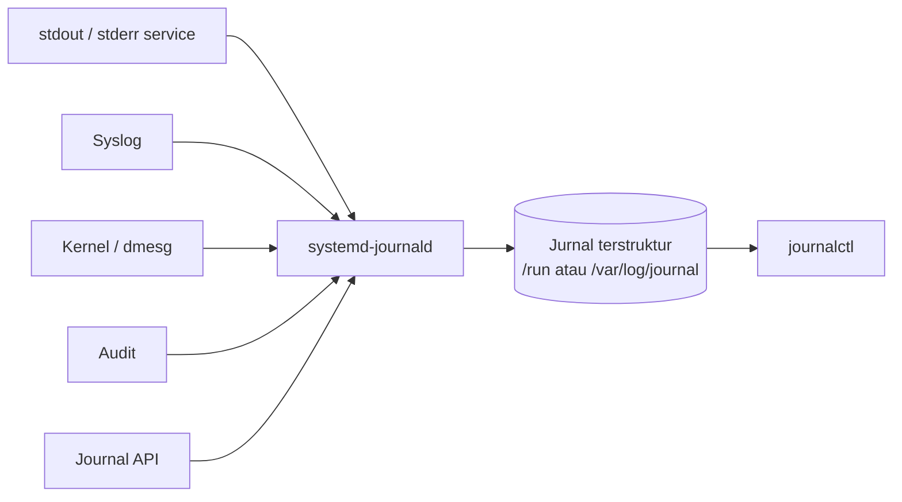

+++
draft = false
date = '2026-08-14'
title = 'Memahami systemd Journald untuk Logging dan Debugging Service di Linux'
type = 'blog'
description = 'Mengulik systemd journald sebagai pusat logging: cara kerja jurnal, membaca log dengan journalctl, filter berdasarkan unit, waktu, boot, dan prioritas, sampai bikin log persisten dan mengatur retensinya'
image = ''
tags = ['systemd', 'journald', 'logging', 'linux']
+++

## Latar Belakang

Belakangan saya cukup sering bikin [systemd service buat jalanin binary custom](/blog/menjalankan-aplikasi-sebagai-systemd-service-di-linux/) dan [systemd timer sebagai pengganti cron](/blog/menjadwalkan-task-dengan-systemd-timer-sebagai-pengganti-cron-di-linux/). Alurnya sudah jadi kebiasaan: bikin unit file, `daemon-reload`, `enable --now`, jalan. Masalahnya, alur itu cuma mengurus sisi "gimana cara jalaninnya". Begitu ada service yang tiba-tiba `failed`, pertanyaannya langsung ganti jadi "kenapa dia mati, dan di mana saya bisa melihat lognya".

Refleks lama saya langsung masuk ke `WorkingDirectory` servicenya, ngintip apakah aplikasinya ninggalin file log di sana. Tapi kosong. Service yang dijalankan lewat systemd nggak nulis file log sendiri kecuali memang diprogram begitu. Semua `stdout` dan `stderr` disimpan di dalam satu komponen bernama **journald**, lalu disimpan dalam format database terindeks, bukan teks polos yang bisa dibaca melalui `tail` atau `cat`. Sebenarnya journald bukan hal yang asing buat saya, cuma memang jarang saya sentuh soalnya kebiasaan saya cuma ngecek servicenya jalan atau nggak, jarang sampai baca lognya.

Selama ini saya berhenti di `systemctl status`, sekadar mastiin servicenya `active` atau `failed`, tanpa pernah beneran baca lognya. Padahal jawaban "kenapa dia mati" itu justru ada di dalam jurnal yang dikelola journald, bukan di status. Jadi saya putuskan buat berhenti nebak dan benar-benar duduk ngulik journald. Post ini catatan hasilnya: gimana journald ngumpulin log, cara baca dan filternya lewat `journalctl`, sampai bikin log awet lintas reboot dan ngatur biar nggak menuh-menuhin disk.

## Permasalahan

Dari kebiasaan cuma ngecek service jalan atau nggak, ada beberapa hal yang bikin saya mentok begitu harus benar-benar cari tahu kenapa sebuah service `failed`:

- **Nggak nemu file log buat dibaca**, refleks ngintip `WorkingDirectory` service nemunya kosong, karena aplikasinya emang nggak nulis file `.log` sendiri. Terus outputnya ke mana?
- **`systemctl status` cuma ngasih cuplikan**, dia nampilin beberapa baris log terakhir doang, sering kepotong tepat sebelum bagian yang saya butuh buat tahu penyebabnya
- **Bukan file teks biasa**, giliran ketemu `/var/log/journal`, isinya bukan teks polos tapi format database terindeks, jadi nggak bisa dibaca pakai `cat` atau `grep` langsung. Harus lewat tool khusus
- **`journalctl` outputnya kebanyakan**, giliran nemu tool-nya, jalanin `journalctl` polos malah ngasih ribuan baris log dari semua service. Gimana cara filter yang saya butuh doang?
- **Log hilang setelah reboot**, di beberapa server, log dari boot sebelumnya lenyap begitu mesin restart. Padahal justru sesi boot itu yang mau saya periksa waktu server sempat crash
- **Takut disk penuh**, kalau semua log ditumpuk di satu jurnal, apa nggak lama-lama makan disk sampai habis?

## Cara Kerja Journald

**journald** adalah daemon logging bawaan systemd, prosesnya `systemd-journald`. Tugasnya menampung log dari banyak sumber sekaligus lalu menyimpannya dalam satu jurnal terstruktur, mirip database kecil yang terindeks ketimbang file teks polos. Alurnya kira-kira seperti ini:



Semua sumber log bermuara ke satu daemon, ditulis ke satu jurnal, lalu dibaca kembali lewat satu pintu. Sumber yang ditampung antara lain:

| Sumber                        | Keterangan                                                             |
| ----------------------------- | ---------------------------------------------------------------------- |
| `stdout` dan `stderr` service | Semua yang dicetak service yang dijalankan systemd otomatis masuk sini |
| Syslog                        | Pesan lewat `syslog()` API dari aplikasi tradisional                   |
| Kernel                        | Ring buffer kernel, isinya sama seperti `dmesg`                        |
| Audit                         | Event dari kernel audit subsystem                                      |
| Journal API                   | Aplikasi yang kirim log terstruktur langsung ke journald               |

Kunci yang bikin journald beda dari file log biasa: tiap entri log itu **terstruktur**, bukan sekadar baris teks. Satu baris log yang di terminal cuma keliatan seperti kalimat biasa, di dalam jurnal sebenarnya tersimpan dengan sekumpulan field. Berikut satu entri utuh kalau saya buka pakai `journalctl -o verbose`.

```
Fri 2026-06-26 12:53:01.712802 WIB [s=874032e5a4e84b3ea2663fbafd13fa14;i=70f924;b=e26b5005c7ad48fb854288a24c03d174;m=2baed01f5;t=65521b8b989a2;x=5476e19f121261ac]
    PRIORITY=6
    _SYSTEMD_SLICE=system.slice
    _BOOT_ID=e26b5005c7ad48fb854288a24c03d174
    _MACHINE_ID=2456d023dae749ef9416d22b48d7c5fa
    _HOSTNAME=mnabila.com
    _RUNTIME_SCOPE=system
    _TRANSPORT=stdout
    SYSLOG_FACILITY=3
    _STREAM_ID=cfdec3b40cb14f9b98464c7dc35c740d
    SYSLOG_IDENTIFIER=myapp
    MESSAGE=connection refused on port 8080
    _PID=605
    _UID=62582
    _GID=62582
    _COMM=myapp
    _EXE=/opt/myapp/server
    _CMDLINE=/opt/myapp/server --config /etc/myapp/config.toml
    _CAP_EFFECTIVE=400
    _SYSTEMD_CGROUP=/system.slice/myapp.service
    _SYSTEMD_UNIT=myapp.service
    _SYSTEMD_INVOCATION_ID=27d4c7baa3b94e199c4cba72a490acd1
```

Kelihatan banyak, tapi sebagian besar cuma metadata. Penjelasan beberapa field penting di contoh itu:

| Field           | Nilai contoh                             | Keterangan                                                                       |
| --------------- | ---------------------------------------- | -------------------------------------------------------------------------------- |
| `MESSAGE`       | `connection refused on port 8080`        | Isi pesan log yang sebenarnya, satu-satunya bagian yang keliatan di output biasa  |
| `PRIORITY`      | `6`                                      | Level prioritas syslog, `6` berarti `info`                                       |
| `_PID`          | `605`                                    | Process ID dari proses yang mencetak log                                         |
| `_UID` / `_GID` | `62582`                                  | User dan group ID pemilik proses                                                 |
| `_COMM`         | `myapp`                                  | Nama command proses, dipotong maksimal 15 karakter                              |
| `_EXE`          | `/opt/myapp/server`                      | Path lengkap ke binary yang lagi dieksekusi                                       |
| `_CMDLINE`      | `/opt/myapp/server --config ...`         | Perintah lengkap plus argumennya waktu proses dijalankan                         |
| `_TRANSPORT`    | `stdout`                                 | Jalur masuknya log ke journald, di sini lewat `stdout`                           |
| `_HOSTNAME`     | `mnabila.com`                            | Nama host tempat log dihasilkan                                                   |
| `_SYSTEMD_UNIT` | `myapp.service`                          | Unit systemd asal log, ini yang jadi kunci filter `-u`                           |
| `_BOOT_ID`      | `e26b5005...`                            | ID unik sesi boot, ini yang jadi kunci filter `-b`                               |

Coba lihat bedanya. `MESSAGE` itu datang dari aplikasinya, isinya terserah si aplikasi mau nulis apa. Beda cerita sama field yang berawalan garis bawah seperti `_PID`, `_UID`, dan `_EXE`. Yang ini disebut **trusted field**, journald yang ngisi sendiri berdasarkan proses pengirimnya, jadi aplikasi nggak bisa ikut campur apalagi malsuin lognya. Berkat field-field ini juga jurnal bisa langsung tahu "siapa yang ngirim log ini" tanpa perlu nebak-nebak dari isi pesannya.

Field kayak `_SYSTEMD_UNIT`, `PRIORITY`, dan `_BOOT_ID` inilah yang jadi pegangan buat filter log nanti, nggak perlu lagi mikir pola `grep` regex yang bikin pusing. Pas saya ngetik `journalctl -u myapp`, journald sebenarnya tinggal ngambil entri yang `_SYSTEMD_UNIT`-nya `myapp.service`, bukan nyocokin teks satu per satu.

Karena bentuknya database terindeks, isi jurnal emang nggak bisa diintip langsung pakai `cat`. Satu-satunya pintu masuk ya `journalctl`. Gampangnya, anggap aja `journalctl` itu klien buat query ke database log, bukan sekadar `tail` file biasa.

## Membaca Log dengan journalctl

Perintah paling dasar cuma manggil `journalctl` tanpa argumen, tapi itu nampilin semua log dari awal jurnal dan bikin kebanjiran. Yang lebih sering saya pakai justru filter per unit. Buat lihat log satu service tertentu, pakai flag `-u`.

```bash
# Lihat semua log dari service bernama myapp
$ journalctl -u myapp
```

Output-nya persis seperti file log, tapi sudah otomatis difilter cuma untuk unit `myapp`. Buat debugging service yang barusan mati, saya biasanya gabung beberapa flag sekaligus.

```bash
# 50 baris terakhir dari myapp, langsung loncat ke bawah, plus ikuti log baru
$ journalctl -u myapp -n 50 -f
```

Beberapa flag yang paling sering saya pakai buat baca log:

| Flag          | Fungsi                                                                 |
| ------------- | ---------------------------------------------------------------------- |
| `-u <unit>`   | Filter cuma log dari unit tertentu                                     |
| `-f`          | Follow, mirip `tail -f`, ikuti log baru secara real time               |
| `-n <angka>`  | Tampilkan N baris terakhir (default 10 kalau `-n` tanpa angka)         |
| `-e`          | Langsung loncat ke entri paling akhir                                  |
| `-r`          | Urutan terbalik, yang paling baru di atas                              |
| `--no-pager`  | Jangan pakai pager, langsung cetak ke stdout, enak buat scripting      |
| `-o <format>` | Ubah format output, misalnya `json`, `json-pretty`, `cat`, `short-iso` |

Flag `-o cat` lumayan berguna kalau saya cuma mau lihat isi pesannya tanpa timestamp dan metadata di depan, sementara `-o json-pretty` kepakai waktu mau lihat semua field terstruktur yang disimpan journald buat satu entri.

## Filter Berdasarkan Waktu dan Boot

Nyari log di rentang waktu tertentu jauh lebih enak di journald ketimbang file teks. Ada flag `--since` dan `--until` yang paham bahasa natural.

```bash
# Log dalam 15 menit terakhir
$ journalctl -u myapp --since "15 min ago"

# Log dari rentang waktu spesifik
$ journalctl -u myapp --since "2026-08-14 09:00:00" --until "2026-08-14 10:30:00"

# Log sejak kemarin
$ journalctl --since yesterday
```

Selain waktu, journald juga nyatet tiap sesi boot dengan **boot ID** unik. Ini penting banget waktu debugging masalah yang muncul setelah reboot, karena saya bisa misahin log per sesi boot. Buat lihat daftar boot yang tercatat, pakai `--list-boots`.

```bash
# Daftar semua sesi boot yang masih tersimpan di jurnal
$ journalctl --list-boots
```

```
IDX BOOT ID                          FIRST ENTRY                 LAST ENTRY
 -1 a1b2c3d4e5f6...                  Wed 2026-08-13 08:12:04 WIB Wed 2026-08-13 22:41:19 WIB
  0 f6e5d4c3b2a1...                  Thu 2026-08-14 07:03:55 WIB Thu 2026-08-14 09:58:20 WIB
```

Kolom `IDX` inilah yang dipakai buat rujuk sesi boot. Boot sekarang selalu `0`, boot sebelumnya `-1`, dan seterusnya mundur ke belakang. Buat baca log dari boot tertentu, pakai flag `-b`.

```bash
# Log dari boot saat ini
$ journalctl -b 0

# Log dari boot sebelumnya, berguna buat cari tahu kenapa server crash lalu reboot
$ journalctl -b -1 -p err
```

> **Tip:** Kalau server tahu-tahu reboot sendiri, hal pertama yang saya cek biasanya `-b -1 -p err`. Perintah ini cuma nampilin error dari sesi boot sebelum mesin mati, dan dari situ biasanya ketahuan apa yang bikin dia crash.

## Filter Berdasarkan Prioritas

Tiap entri log itu punya level prioritas yang ngikutin standar syslog, mulai dari `0` untuk `emerg` sampai `7` untuk `debug`. Nah, flag `-p` dipakai buat filter log berdasarkan level ini. Cara kerjanya inklusif ke arah yang lebih gawat, jadi pas saya ngetik `-p warning`, yang muncul bukan cuma warning, tapi `err`, `crit`, dan yang lebih parah lagi ikut kebawa.

| Angka | Nama      | Keterangan                     |
| ----- | --------- | ------------------------------ |
| 0     | `emerg`   | Sistem tidak bisa dipakai      |
| 1     | `alert`   | Harus ditindak segera          |
| 2     | `crit`    | Kondisi kritis                 |
| 3     | `err`     | Error biasa                    |
| 4     | `warning` | Peringatan                     |
| 5     | `notice`  | Normal tapi perlu diperhatikan |
| 6     | `info`    | Informasi biasa                |
| 7     | `debug`   | Pesan debug yang sangat detail |

```bash
# Cuma tampilkan error ke atas dari myapp
$ journalctl -u myapp -p err

# Warning ke atas di rentang prioritas tertentu
$ journalctl -u myapp -p warning..crit
```

Buat sekadar cek "ada yang lagi bermasalah nggak di sistem", saya sering jalanin `journalctl -p err -b` buat lihat semua error di boot sekarang, lintas semua service sekaligus.

## Membuat Log Persisten dan Mengatur Retensi

Ini jawaban buat masalah log yang hilang setelah reboot. Secara default, di sebagian distro journald nyimpan log di `/run/log/journal`, yang berada di memori (tmpfs). Konsekuensinya, semua log lenyap tiap kali mesin restart. Buat bikin log awet, journald cuma butuh direktori `/var/log/journal` ada.

```bash
# Bikin direktori jurnal persisten lalu suruh journald baca ulang
$ sudo mkdir -p /var/log/journal
$ sudo systemd-tmpfiles --create --prefix /var/log/journal
$ sudo systemctl restart systemd-journald
```

Setelah direktori itu ada, journald otomatis pindah dari mode volatile ke persistent. Buat kontrol lebih eksplisit, saya set `Storage=persistent` di file konfigurasinya, `/etc/systemd/journald.conf`.

```ini
[Journal]
Storage=persistent
SystemMaxUse=500M
SystemMaxFileSize=50M
MaxRetentionSec=1month
```

Penjelasan tiap parameter yang saya set:

| Parameter           | Fungsi                                                        |
| ------------------- | ------------------------------------------------------------- |
| `Storage`           | `persistent` maksa log disimpan ke disk, bukan cuma di memori |
| `SystemMaxUse`      | Batas total ruang disk yang boleh dipakai jurnal              |
| `SystemMaxFileSize` | Ukuran maksimal tiap file jurnal sebelum dirotasi             |
| `MaxRetentionSec`   | Umur maksimal log sebelum otomatis dihapus                    |

Batasan inilah yang bikin saya tenang soal disk penuh. journald ngerotasi dan ngehapus log lama sendiri begitu nyentuh salah satu batas, jadi nggak ada tuh log numpuk tanpa henti. Buat cek berapa disk yang lagi dipakai jurnal sekarang, ada subperintah `--disk-usage`.

```bash
# Lihat total ukuran jurnal di disk
$ journalctl --disk-usage
```

```
Archived and active journals take up 384.2M in the file system.
```

Kalau butuh mangkas manual tanpa nunggu rotasi otomatis, `--vacuum-size` dan `--vacuum-time` bisa dipakai buat ngosongin secara paksa.

```bash
# Sisakan cuma 200M log terbaru, sisanya hapus
$ sudo journalctl --vacuum-size=200M

# Hapus semua log yang lebih tua dari 2 minggu
$ sudo journalctl --vacuum-time=2weeks
```

> **Note:** Tiap habis ngubah `journald.conf`, jangan lupa `sudo systemctl restart systemd-journald` biar konfigurasinya kebaca. Sama seperti `daemon-reload` di unit file, perubahan config nggak ngefek sampai daemon-nya baca ulang.

## Alur Debugging Service yang Failed

Biar nggak berhenti di teori, ini urutan yang biasa saya jalanin pas ada service yang tiba-tiba `failed`. Langkah pertama hampir selalu `systemctl status` dulu, sekadar buat lihat gambaran besarnya plus beberapa baris log terakhir.

```bash
# Cek status service, sudah nampilin cuplikan log terakhir
$ systemctl status myapp
```

Masalahnya, cuplikan dari `status` itu cuma 10 baris terakhir, sering belum nyampe ke akar masalahnya. Jadi saya lanjut nyelam ke log lengkap unit-nya, difilter cuma error dari boot sekarang.

```bash
# Log lengkap myapp, error ke atas, boot sekarang, yang terbaru di atas
$ journalctl -u myapp -p err -b 0 -r
```

Kalau servicenya restart terus menerus, biasanya saya persempit ke rentang waktu pas sebelum kejadian pakai `--since`. Atau kalau mau lihat langsung, saya pantau lognya real time pakai `-f` sambil nyoba nyalain ulang servicenya dari terminal lain. Intinya polanya selalu sama, berangkat dari `status` yang gambarannya masih luas, lalu pelan-pelan dikerucutin lewat filter unit, prioritas, boot, dan waktu. Buat saya cara ini hampir selalu cukup buat nemu baris error yang jadi biang keroknya, tanpa perlu sekali pun buka file log secara manual.

## Insight dan Pembelajaran

- **journald itu database log, bukan file teks**, jadi jangan nyari file `.log` buat service systemd. Semua `stdout` dan `stderr`-nya udah masuk ke jurnal terstruktur, dan satu-satunya pintu buat bacanya ya `journalctl`
- **Tiap entri nyimpen metadatanya sendiri**, field kayak `_SYSTEMD_UNIT`, `_PID`, dan `_BOOT_ID` itu dilampirin journald sendiri, bukan dari aplikasi. Justru dari sini log bisa langsung difilter tanpa perlu `grep` dengan regex yang ribet
- **Filter itu jantungnya journalctl**, kekuatan aslinya bukan di baca lognya, tapi di cara ngefilternya. Begitu hafal `-u`, `-p`, `-b`, dan `--since`, debugging berubah dari ngubek-ngubek log file jadi kayak nyari data ke database, cuma isinya log
- **`-b -1` itu penyelamat pas investigasi abis reboot**, karena log kepisah per sesi boot, saya bisa ngintip apa yang terjadi sebelum server crash. Hal yang susah banget dilakuin kalau lognya cuma file teks yang keburu ketimpa
- **Log persisten itu opt-in di sebagian distro**, kalau lognya hilang tiap reboot, kemungkinan besar jurnalnya masih nyangkut di memori. Cukup bikin folder `/var/log/journal` biar log-nya awet lintas reboot
- **Retensi itu diatur, bukan dipasrahin**, `SystemMaxUse` sama `MaxRetentionSec` bikin journald ngerotasi lognya sendiri. Jadi ketakutan disk penuh gara-gara log itu sebenernya nggak beralasan selama batasnya udah diset
- **Prioritas bikin sinyal keliatan di tengah noise**, `-p err` nyembunyiin ribuan baris `info` dan langsung nunjukin mana yang beneran lagi bermasalah

## Penutup

journald mengubah cara saya memperlakukan log, dari sekadar baca file teks pakai `tail` jadi mencari lewat query ke jurnal terstruktur. Yang tadinya kerasa aneh karena formatnya biner justru berubah jadi keunggulan, sebab metadata tiap entri bikin filter berdasarkan unit, waktu, boot, dan prioritas jadi presisi. Buat siapa pun yang sudah nyaman bikin systemd service dan timer, menguasai `journalctl` adalah keping terakhir yang bikin siklus deploy, jalan, dan debugging jadi utuh dalam satu ekosistem systemd.

## Referensi

- [systemd-journald.service - Journal service](https://www.freedesktop.org/software/systemd/man/latest/systemd-journald.service.html), diakses pada 2026-08-14
- [journalctl - Query the systemd journal](https://www.freedesktop.org/software/systemd/man/latest/journalctl.html), diakses pada 2026-08-14
- [journald.conf - Journal service configuration](https://www.freedesktop.org/software/systemd/man/latest/journald.conf.html), diakses pada 2026-08-14
- [systemd/Journal - ArchWiki](https://wiki.archlinux.org/title/Systemd/Journal), diakses pada 2026-08-14
