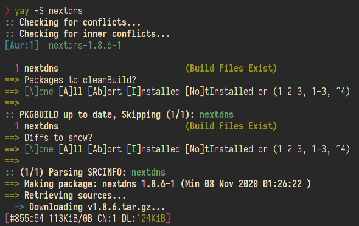
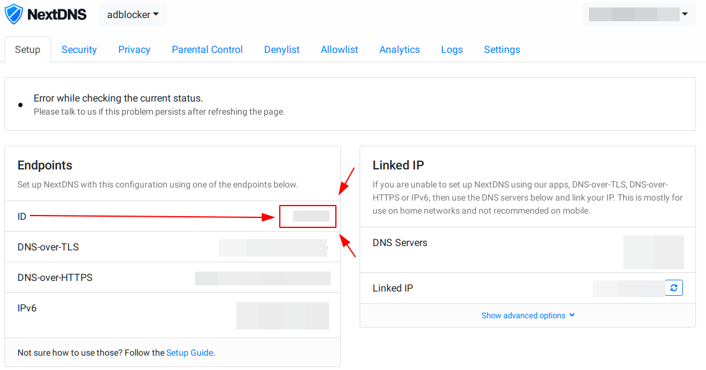

# Intro

Nextdns merupakan sebuah startup atau perusahaan yang berkerja dibidang penyedia layanan firewall yang bertujuan untuk meningkatkan keamanan pengguna ketika berselancari di internet.
Nextdns melindungi penggunanya dari berbagai masalah keamanan seperti memblokir iklan yang mengganggu, memblokir pelacakan dari situs yang sedang dikunjunginya dan masih banyak lagi.

# Pembahasan

Pada kesempatakn kali ini saya mencoba mengimplementasikan nextdns pada archlinuxku sebagai alternativenya si dnscrypt yang kupakek sekarang.
Untuk installasinya cukup mudah yakni tinggal copas perintah dibawah ini, tapi jangan lupa bikin akun dulu di [https://nextdns.io](https://nextdns.io)

```bash
$ yay -S nextdns
```



setelah installasi selesai maka dilanjutkan dengan mengaktifkan service nextdnsnya dan jangan lupa pastikan nextdns sudah beneran berjalan atau belum.

```bash
$ sudo systemctl start mextdns
$ sudo systemctl status mextdns
```


Belum selesai sampai sini jadi perlu lanjut lagi ketahap berikutnya yakni memasukkan nextdns idnya, langkah langkahnya sebagai berikut ini

- sekarang buka [my.nextdns.io](https://my.nextdns.io) lalu salin nextdns idnya (lihat gambar biar lebih jelas)
  

- Setelah nextdns id didapatkan ketikkan perintah dibawah ini
  ```bash
  $ sudo nextdns install -config <nextdns-id> -setup-router
  ```
- Buka network manager yang kalian gunakan sebagai contoh saya disini menggunakan **NetworkManager**. kemudian masukkan `127.0.0.1` dibagian dns server dan search domainnya.
  
  alternative lainnya kalian bisa langsung mengubah file yang ada di `/etc/resolv.conf` dan ubah alamat ip dnsnya menjadi `127.0.0.1`

- langkah terakhir test ping ke salah satu domain
  

# Kesimpulan

- kelebihan
  - kesimpulannya yakni instalasinya cukup mudah tidak perlu susah payah ubah file configurasinya secara manual
  - nextdns client ini tidak memerlukan resouce yang banyak
- kekurangan
  - ada limitasi query perbulannya yakni 300k query jadi klok lebih dari itu perlu upgrade sayan

>Referensi
> + [https://github.com/nextdns/nextdns](https://github.com/nextdns/nextdns/wiki)
