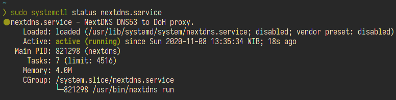
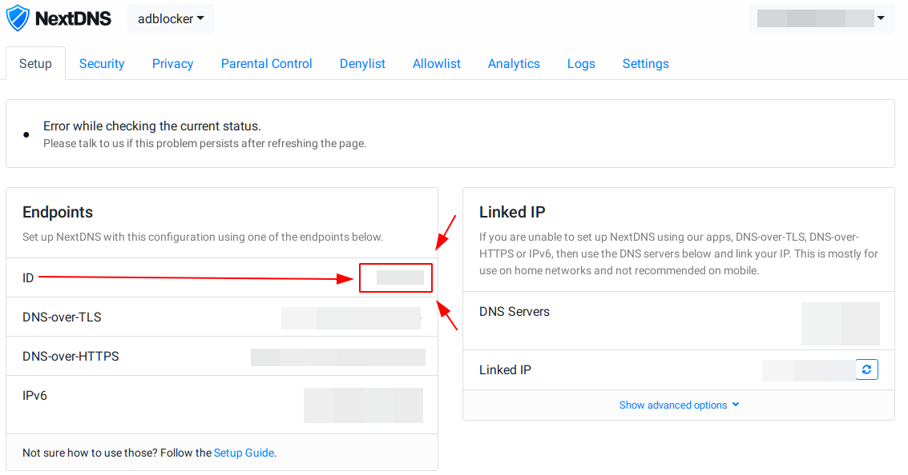
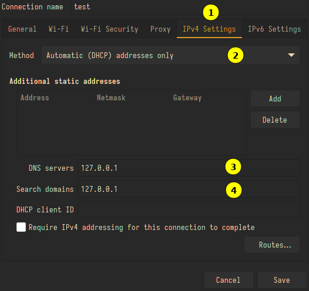
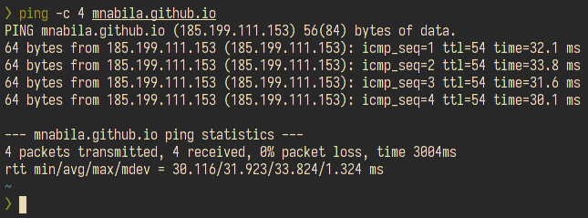

:toc:

Pada kesempatakn kali ini aku sedang mencoba mengimplementasikan nextdns sebagai alternative si dnscrypt yang kupakek sekarang. Nextdns merupakan sebuah penyedia layanan firewall yang bertujuan untuk meningkatkan keamanan pengguna ketika berselancari di internet. Tidak hanya itu nextdns juga memberikan beberapa perlindugngan dari berbagai masalah keamanan seperti memblokir iklan yang mengganggu, memblokir pelacakan dari situs yang sedang dikunjunginya dan masih banyak lagi.

== instalasi
disini aku mencoba mengimplementasikan nextdns ini kedalam beberapa service, seperti:

* nextdns-client
* systemd-resolved 
* dnscrypt-proxy 

=== nextdns-client
untuk instalasi nextdns-client cukup ketikkan perintah dibawah ini jika anda menggunakan distro archlinux, dikarenakan nextdns-client ini berada di repository AUR(Arch User Repository)

----
$ yay -S nextdns
----

image:./img/instalasi.png[]

setelah installasi dilanjutkan dengan mengaktifkan service nextdnsnya

----
$ sudo systemctl start mextdns
----

dan jangan lupa pastikan nextdns sudah beneran berjalan atau belum.

----
$ sudo systemctl status mextdns
----

setelah service nextdnsnya aktif maka dilanjutkan dengan memasukkan id. langkah-langkahnya sebagai berikut ini:

* buka https://my.nextdns.io[my.nextdns.io] lalu salin nextdns idnya (lihat gambar biar lebih jelas)
  

* Setelah nextdns id didapatkan ketikkan perintah dibawah ini

  $ sudo nextdns install -config <nextdns-id> -setup-router

== Uji Coba 
Buka network manager yang kalian gunakan sebagai contoh saya disini menggunakan **NetworkManager**. kemudian masukkan `127.0.0.1` dibagian dns server dan search domainnya.

alternative lainnya kalian bisa langsung mengubah file yang ada di `/etc/resolv.conf` dan ubah alamat ip dnsnya menjadi `127.0.0.1`
langkah terakhir test ping ke salah satu domain

== Kesimpulan

* **kelebihan**
  ** instalasinya cukup mudah tidak perlu susah payah ubah file konfigurasinya secara manual
  ** nextdns client ini tidak memerlukan resouce yang banyak
* **kekurangan**
  ** ada limitasi query perbulannya yakni 300k query jadi klok lebih dari itu perlu upgrade sayan

== Referensi
* https://github.com/nextdns/nextdns/wiki Diakses pada: 2020-11-08
