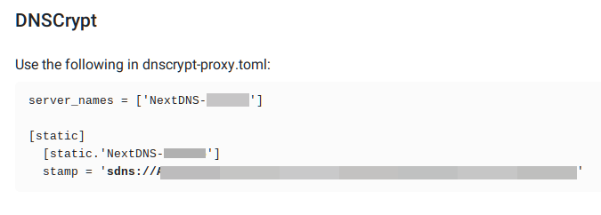
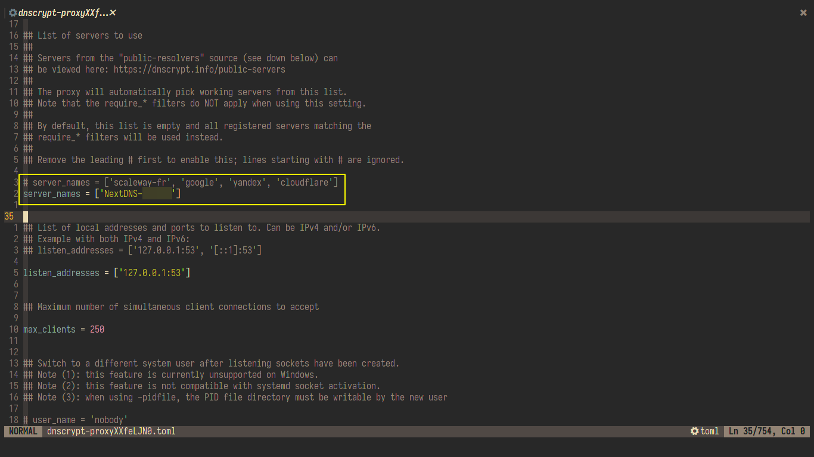
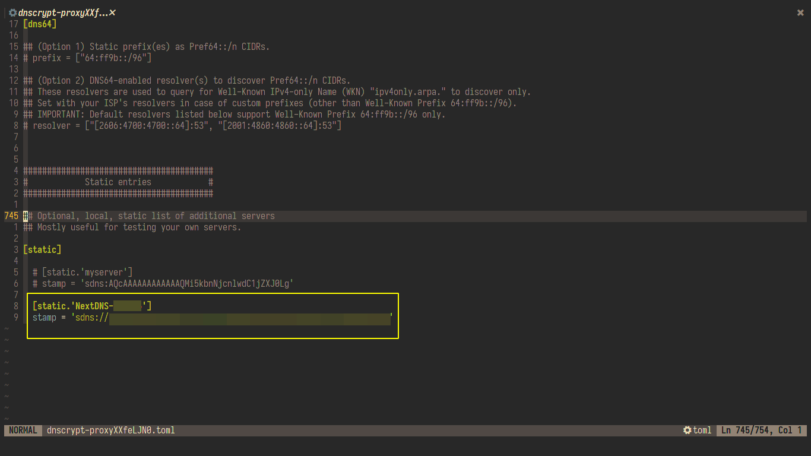
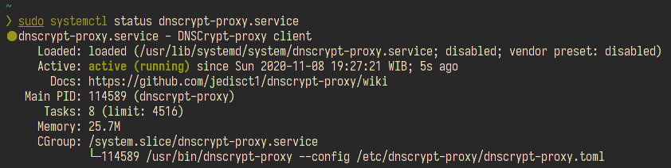

# Intro

Sebelum berpindah ke nextdns, saya sebenernya pengguna dnscrypt-proxy akan tetapi karna di nextdns ada fitur yang menurut saya menarik alhasil saya bermigrasi ke nextdns client.

Nah disisilain saya memiliki 2 aplikasi yang memiliki fungsi sama tapi mau uninstall dnscrypt-proxy kok masih sayang, mengingat protocol dnscrypt lebih aman dibandingkan protocol yang digunakan di nextdns-client yang mana di nextdns-client ini mengggunakan protocol DOT(Dns Over TLS). Karna hal itu saya jadi kepikiran bagaimana cara mengimplementasikan si nextdns ini kedalam dnscrypt-proxy.

> untuk penjelasan lebih lanjut mengenai protocol dnscrypt sama DOT temen temen bisa baca disini [https://dnscrypt.info](https://dnscrypt.info/faq)

# Pembahasan

Sebelum ke pembahasan utama, sepertinya saya perlu mengulas sedikit mengenai dnscrypt yang akan saya gunakan. Dnscrypt merupakan sebuah protocol yang digunakan untuk mengautentikasi komunikasi antara `dns client` menuju `dns resolver` yang bertujuan untuk menghindari terjadinya `dns spoofing`.

Ketika `dns client` mengirimkan request ke `dns resolver`, dnscrypt ini mengenkripsi data yang dikirimkan baik dari `dns client` maupun dari `dns resolver` sehingga data yang diterima oleh `dns client` tidak dapat dirubah oleh pihak pihak yang tidak bertanggung jawab.

nah begitulan sedikit penjelasan mengenai protocol dnscrypt ini, selanjutnya adalah pembahasan mengenai aplikasi dnscrypt-proxy

## implementasi nextdns kedalam konfigurasi dnscrypt-proxy

langkah pertama yang jelas adalah kita harus punya akun nextdns.io terbelih dahulu, baru dilanjut melakukan instalasi dnscrypt-proxy, instalasi dnscrypt-proxy ini cukup mudah yakni dengan perintah seperti dibawah ini

```bash
$ yay -S dnscrypt-proxy
```

setelah instalasi selesai maka ubah konfigurasi dnscrypt-proxy yang ada di `/etc/dnscrypt-proxy/dnscrypt-proxy.toml` menggunakan teks editor kesayangan kalian. disini saya menggunakan teks editor `neovim` yang dipanggil melalui perintah `sudoedit`. sampai sini kita akan menambahkan private dns resolver yang kita dapatkan dari nextdns,

untuk mendapatkan private dns resolvernya temen temen bisa muka [https://my.nextdns.io/](https://my.nextdns.io/) kemudian masuk bagian setup dan scroll kebawah sampai ketemu bagian ini.


setelah mendapatkan private dns resolvernya temen temen bisa mengimplementasikan seperti gambar di bawah ini.



setelah private dns resolvernya ditambahkan langkah terakhir tinggal melakukan restart service dnscrypt-proxynya dengan perintah

```bash
$ sudo systemctl restart dnscrypt-proxy
```

Pada tahap ini pastikan dnscrypt-proxynya sudah berjalan atau belum menggunakan perintah dibawah ini

```bash
$ sudo systemctl status dnscrypt-proxy
```


Selanjutnya bukanetwork manager yang kalian gunakan sebagai contoh saya disini menggunakan **NetworkManager**. kemudian masukkan `127.0.0.1` dibagian dns server dan search domainnya.


alternative lainnya kalian bisa langsung mengubah file yang ada di `/etc/resolv.conf` dan ubah alamat ip dnsnya menjadi `127.0.0.1`

langkah terakhir test ping ke salah satu domain


# Kesimpulan
ternyata si nextdns ini juga menyedian sebuah dns resolver  yang menggunakan protocol dnscript untuk berkomunikasi dengan dns client, sehingga user mendapatkan pelayanan yang lebih baik lagi.

> Referensi
>
> - [https://www.dnscrypt.org/](https://www.dnscrypt.org/)
