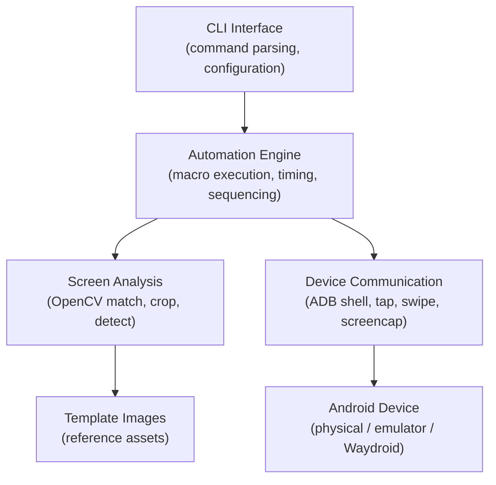

+++
draft = false
date = '2026-05-27T10:00:00+07:00'
title = 'ClashOps'
type = 'project'
description = 'A Rust-based CLI toolkit for automating mobile game interactions through ADB, screen capture, and OpenCV template matching — lightweight, fast, and emulator-compatible.'
image = ''
repository = 'https://github.com/mnabila/clashops'
languages = ['rust']
tools = ['adb', 'opencv']
+++

Mobile strategy games like Clash of Clans involve a significant amount of repetitive interaction — collecting resources, training troops, executing attack sequences. These are tasks that follow predictable patterns and are prime candidates for automation. But most existing automation tools for Android are either bloated Java frameworks, fragile Python scripts with heavy dependencies, or closed-source macro recorders that offer no control over what actually happens on the device.

ClashOps is a lightweight CLI toolkit written in Rust that automates mobile game interactions through ADB device control, screen capture, and OpenCV-based image detection. It is fast, scriptable, and designed to run against both physical devices and emulators including Waydroid.

## Problem Background

Automating interactions in mobile games is not a new problem, but the existing solutions come with trade-offs that make them impractical for someone who wants fine-grained control:

- **Heavyweight frameworks** — tools like Appium or UIAutomator are designed for app testing, not game automation. They introduce massive dependency trees, require server processes, and add latency that makes real-time game interaction unreliable
- **Fragile coordinate-based scripts** — simple ADB tap scripts break the moment screen resolution, DPI, or UI layout changes. They have no awareness of what is actually on the screen
- **No image-based detection** — without the ability to recognize game elements visually, automation is limited to hardcoded coordinates and fixed timing. Any change in the game's rendering invalidates the entire script
- **Python performance limitations** — Python-based OpenCV automation works but introduces noticeable latency in continuous capture-and-detect loops, which matters when you need to react to game state changes in near real-time
- **Emulator compatibility gaps** — many automation tools assume a physical USB-connected device and break when used with Waydroid or other Android emulators that have different ADB connection semantics

I needed a tool that could see what was on the screen, decide what to do based on visual recognition, execute device interactions with minimal latency, and work consistently across different Android environments.

## Solution Overview

ClashOps is a modular CLI application that combines ADB device communication, screen capture, image processing, and automation execution into a single Rust binary. It provides utilities for recording coordinates, capturing screen regions, detecting game elements using OpenCV template matching, and executing tap/swipe sequences — all from the terminal.

**Tech stack:** Rust, ADB (Android Debug Bridge), OpenCV (via Rust bindings), CLI/TUI tooling

**My role:** Sole developer — system design, CLI architecture, automation workflow, image processing implementation, ADB integration, and performance optimization

## System Architecture

The architecture separates concerns into three layers: device communication, screen analysis, and automation execution. Each layer is a distinct module that can be used independently or composed into higher-level workflows.

**Device communication layer.** Wraps ADB commands for screen capture, tap execution, swipe gestures, and device state queries. This layer abstracts the differences between physical devices, standard emulators, and Waydroid — the rest of the application does not need to know what kind of device it is talking to.

**Screen analysis layer.** Handles screen capture acquisition, region cropping, and OpenCV template matching. Given a reference image (a template of a button, resource indicator, or UI element), it locates the element on the current screen and returns its coordinates and confidence score.

**Automation engine.** Composes device commands and screen analysis into executable sequences. A macro might capture the screen, detect whether a specific button is visible, tap it if found, wait for a state transition, and repeat. The engine handles timing, sequencing, and retry logic.

## Key Features

- **ADB device interaction** — execute shell commands, capture screenshots, and perform tap/swipe gestures through a unified Rust interface. Connection handling supports both USB and network-connected devices
- **Screen capture and region recording** — capture full screenshots or cropped regions of the screen. Region recording allows saving specific areas over time, useful for building template image libraries and debugging detection accuracy
- **Coordinate recording utilities** — interactive tools for mapping screen coordinates, making it straightforward to define tap targets and swipe paths for different screen layouts
- **Image-based detection** — OpenCV template matching identifies game elements by visual appearance rather than fixed coordinates. This makes automation resilient to minor UI changes and works across different screen resolutions
- **Tap and swipe automation** — programmable tap sequences and swipe gestures with configurable delays, enabling complex interaction patterns like troop deployment sequences or navigation flows
- **CLI-first workflow** — every capability is accessible as a CLI command, making it trivial to compose automation scripts, pipe outputs, and integrate with other tools
- **Emulator and Waydroid compatibility** — tested and functional with physical devices, standard Android emulators, and Waydroid, with connection handling that adapts to each environment's ADB behavior

## Technical Challenges and Solutions

**Inconsistent screen scaling and device resolutions.** The same game renders differently on a 1080p phone, a 2K tablet, and a Waydroid instance running at the host's native resolution. Hardcoded pixel coordinates break immediately across devices. The solution was two-fold: use OpenCV template matching to locate elements by visual appearance rather than position, and normalize coordinates to relative screen percentages where absolute positioning is necessary. Template images are captured at a reference resolution, and the matching algorithm handles scale differences within a tolerance range.

**Reliable image recognition without ML-heavy dependencies.** Full machine learning pipelines (YOLO, TensorFlow) would provide more robust detection but introduce massive binary sizes, complex build dependencies, and GPU requirements that defeat the purpose of a lightweight tool. OpenCV's template matching (`matchTemplate`) provides sufficient accuracy for detecting known UI elements — buttons, icons, resource indicators — with minimal computational overhead. The trade-off is that it requires pre-captured template images and is sensitive to significant visual changes, but for game automation where UI elements are consistent, this works well in practice.

**Synchronizing automation timing with game rendering.** Mobile games do not expose their internal state. The only way to know if a tap was registered, a transition completed, or a new screen loaded is to capture the screen and check. Naive fixed-delay approaches (tap, sleep 2 seconds, continue) are either too slow or too fast depending on device performance. The solution uses detection-based synchronization: after an action, continuously capture and analyze the screen until the expected state change is detected or a timeout is reached. This makes automation adaptive to actual device performance rather than dependent on hardcoded timing.

**Performance in continuous capture-and-detect loops.** The core automation loop — capture screen, run template matching, decide action, execute — needs to run at a rate fast enough to react to game state changes. In Python-based implementations, this loop typically runs at 1-3 iterations per second. Rust's zero-cost abstractions, combined with direct OpenCV bindings, push this to a significantly higher rate. Minimizing memory allocations in the capture-decode-match pipeline and reusing buffers between iterations keeps latency consistent even during extended automation sessions.

**Supporting multiple Android environments.** ADB behaves differently depending on the target: USB-connected physical devices use a serial number, network devices use an IP:port pair, and Waydroid uses `waydroid shell` or a local ADB connection with a non-standard port. The device communication layer abstracts these differences behind a common interface, with connection detection that identifies the device type and routes commands accordingly.

## Lessons Learned

**Rust's performance characteristics matter for real-time automation.** The difference between a 300ms and a 50ms capture-detect-act cycle is the difference between automation that feels sluggish and reactive and automation that keeps up with game state. Rust's predictable performance, lack of garbage collection pauses, and efficient memory management made a tangible difference in automation reliability.

**Template matching is good enough for structured UIs.** The instinct when building image recognition is to reach for machine learning, but for game automation where the visual elements are known in advance and relatively consistent, classical computer vision techniques like template matching provide the right balance of accuracy, speed, and simplicity. The key insight is matching the tool to the problem — not every detection task needs a neural network.

**ADB is a powerful but underappreciated automation layer.** Most developers interact with ADB only for app installation and log viewing. But `adb shell input tap`, `adb shell screencap`, and `adb shell input swipe` provide a complete remote control interface for any Android device. Combined with screen analysis, ADB becomes a capable automation transport that works across devices, emulators, and containerized Android environments.

**CLI-first design enables composition.** Building every feature as a standalone CLI command — capture, detect, tap, record — means that complex workflows can be composed from simple parts using shell scripting. This proved more flexible than a monolithic automation engine, because new automation patterns can be built without modifying the core tool.

## Conclusion

ClashOps demonstrates that effective mobile automation does not require heavyweight frameworks or complex ML pipelines. A focused combination of ADB for device control, OpenCV for screen analysis, and Rust for performance produces a toolkit that is fast, reliable, and practical for real-world game automation.

The project started as a solution to a specific problem — automating repetitive Clash of Clans interactions — but the underlying architecture is general-purpose. The same capture-detect-act pattern applies to any Android automation scenario where visual recognition is needed: UI testing, accessibility tooling, or interaction recording.

The full source is available on [GitHub](https://github.com/mnabila/clashops). It is a Rust binary with OpenCV as the primary external dependency, designed to be built and used as a single CLI tool.
