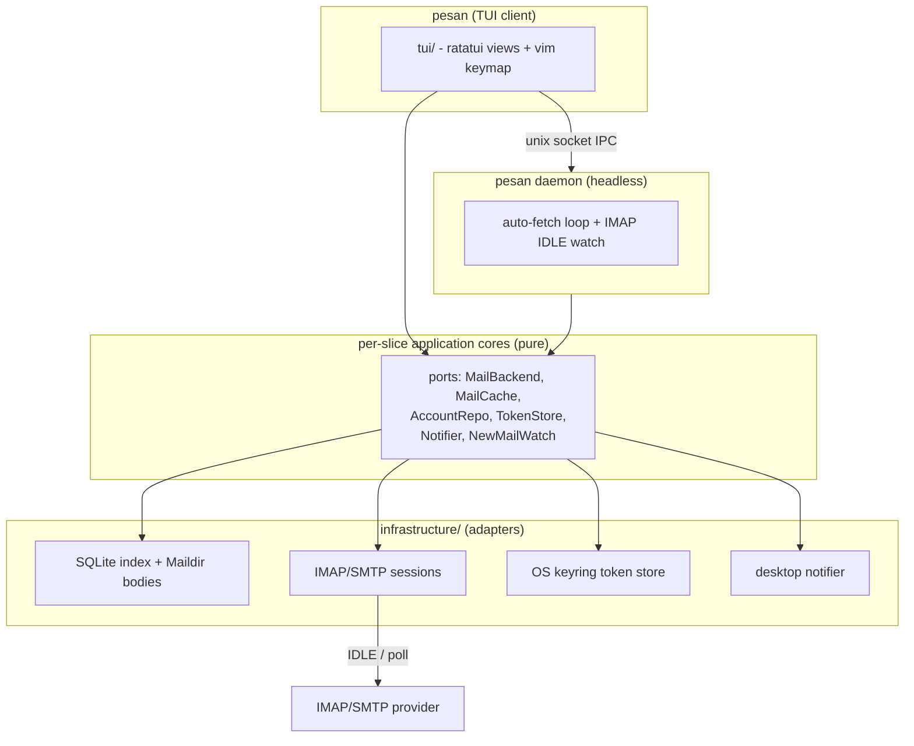

+++
draft = false
date = '2026-09-27T13:46:27+07:00'
title = 'pesan'
type = 'project'
description = 'A keyboard-driven terminal email client in Rust that caches everything locally so it opens instantly, syncs in the background over IMAP IDLE, and authenticates with OAuth2 without ever storing your password.'
image = ''
repository = 'https://github.com/mnabila/pesan'
languages = ['rust']
tools = ['ratatui', 'tokio', 'sqlite', 'imap', 'oauth2']
+++

I live in the terminal, but my email did not. Every time I needed to check mail I reached for a browser tab or a heavy desktop client, waited for it to load, and drove it with a mouse. The graphical clients are capable but slow to open and mouse-first by design. The terminal clients that exist felt like the opposite trade: fast and keyboard-driven, but with fragile OAuth2 support and no real offline story, so every folder switch stalled on the network.

pesan is a terminal email client built around three commitments. It is keyboard-driven with a vim-style keymap, it is offline-first so the UI always shows cached content immediately and syncs live in the background, and it authenticates over OAuth2 so you never type your email password into it. It reads over IMAP, sends over SMTP, and caches everything in a local SQLite index with message bodies mirrored to a Maildir tree. The differentiator is that opening pesan is instant because it never waits on the network to render.

## Problem Background

The clients I had all failed on at least one axis I cared about:

- **Graphical clients are too heavy**: Thunderbird and webmail are feature-complete but slow to launch and built for the mouse. I wanted mail to feel like `git` or `htop`, something that opens in the terminal in under a second and is fully driven from the keyboard
- **Existing TUI clients were weak where it mattered**: the terminal clients I tried had painful OAuth2 setup, or treated the network as the source of truth, so navigating folders and reading messages meant waiting on IMAP round-trips every time
- **No real offline access**: I read the same recent mail constantly, often on a flaky connection. A client that re-fetches the folder list and envelopes on every open is unusable on a train. I wanted the last-known state to render immediately, then reconcile with the server quietly in the background
- **Password-based auth is a dead end**: providers have disabled app passwords and basic auth for IMAP/SMTP, so anything that is not OAuth2 is on borrowed time. I did not want to store a password at all

## Solution Overview

pesan treats the local database as the primary source of truth for the UI and the network as a background reconciler. On launch it renders whatever is cached (folders, envelopes, recently-read bodies) with zero network latency, then a background loop connects each account, syncs, and pushes updates into the view. New mail arrives via IMAP IDLE with a polling fallback, and each arrival raises a desktop notification and prefetches the body so opening it later is instant.

Authentication uses the OAuth2 authorization-code flow with PKCE and a manual copy/paste redirect, so pesan never runs a local web server to catch the callback. Only the refresh token is persisted, and it lives in the OS keyring rather than on disk. The whole app is configured through a commented YAML file with `config.d/` drop-in support, and every action is rebindable.

**Tech stack:** Rust 2024, `ratatui` + `crossterm` (TUI), `tokio` (async runtime), `async-imap` + `lettre` (IMAP/SMTP), `sqlx` + SQLite (cache), `oauth2` (auth), `keyring` (token storage), `notify-rust` (desktop notifications)

**My role:** Sole developer, architecture, implementation, and documentation

## System Architecture

pesan is built as a hexagonal (ports and adapters) architecture, sliced by feature rather than by layer. Each slice (`mail`, `account`) owns a pure `application` core that defines the ports it needs as traits and holds all the logic, but never imports the UI, spawns tasks, or touches IO directly, alongside its own `infrastructure` adapters (SQLite, IMAP, keyring, desktop notifier). A shared `platform` slice supplies cross-cutting infrastructure (config, OAuth2, secrets, the database pool, runtime), `ui` is the ratatui driver, and `wiring` binds the ports to their concrete adapters.



The source is organized by feature slice, each internally hexagonal:

```
src/
  mail/            -- mail slice: read, send, cache, sync
    domain.rs      -- core mail types (Envelope, MailUpdate, NewMail), no dependencies
    application/   -- pure use cases + port traits (fetch, folders, search, mutations, open, prefetch)
    infrastructure/-- adapters: IMAP/SMTP backend, SQLite cache, Maildir store, IDLE watch, IPC
  account/         -- account slice: onboarding, connect, token store
    domain.rs      -- account core types
    application/   -- use cases + port traits (connect, onboarding)
    infrastructure/-- account repo + keyring-backed token store
  platform/        -- cross-cutting infra: config, OAuth2, keyring/secrets, DB pool, runtime, boot
  ui/              -- ratatui driver: views, widgets, keymap parsing, app state
  wiring/          -- binds the ports to their concrete adapters
  daemon.rs        -- the headless auto-fetch loop + local mail server
  layering_tests.rs-- build-failing test that keeps each slice's core pure
```

The ports the core depends on:

| Port           | Responsibility                                           |
| -------------- | -------------------------------------------------------- |
| `MailBackend`  | Live IMAP/SMTP operations (fetch, send, flag, move)      |
| `MailCache`    | The local SQLite index plus the Maildir body store       |
| `AccountRepo`  | Persisted account records                                |
| `TokenStore`   | Refresh-token storage, keyring-backed with a DB fallback |
| `Notifier`     | Desktop notifications on new mail                        |
| `NewMailWatch` | IMAP IDLE (or polling) watch that raises arrival events  |

The most consequential structural decision is the **client/daemon split**. `pesan daemon` is a headless process that owns the live IMAP/SMTP sessions, runs the auto-fetch loop, watches folders over IMAP IDLE, and raises notifications. It serves those sessions to the TUI over a unix socket, so a running client routes its operations through the daemon instead of opening its own connections. The daemon can run as a systemd user service, keeping mail warm even when no TUI is open.

## Key Features

- **Offline-first rendering**: the UI reads from the SQLite cache and shows content immediately on launch, then reconciles with the server in the background. Folder switches and message reads never block on the network
- **Push notifications via IMAP IDLE**: new mail is detected through IMAP IDLE with a polling fallback, raising a desktop notification and prefetching the body so opening it later is instant
- **OAuth2 with no stored password**: authorization-code flow with PKCE and a manual copy/paste redirect, so pesan runs no local web server. Only the refresh token is kept, in the OS keyring, with automatic re-authorization when a token is rejected
- **Headless daemon**: `pesan daemon` keeps sessions live and mail synced as a systemd user service, independent of whether the TUI is running
- **Vim-style, fully rebindable keymap**: every action is remappable per keymap section (global, list, reader, compose, and more) through the config, with chords like `gg` and modifier keys supported
- **Modular YAML configuration**: a single commented `config.yaml` plus `config.d/` drop-ins that deep-merge, so providers, themes, notifications, and keybindings can live in separate fragments
- **Maildir body mirror**: message bodies are stored as interoperable Maildir files alongside the SQLite index, so the cache is inspectable and not locked inside a database

## Technical Challenges and Solutions

**Sharing one live IMAP session between the client and the daemon.** Running the TUI and the daemon as separate processes creates an obvious problem, since both would open their own IMAP connections, doubling logins and racing on the same mailbox state. The solution is that the daemon is the single owner of every live session, and the TUI routes its operations to the daemon over a unix socket. A session hub inside the daemon hands back a command handle per account, connecting lazily on first use, and arrivals are fanned out to subscribed clients over a small bounded broadcast channel. The trade-off is a bounded push buffer: a client that lags behind simply misses a push and re-syncs from the cache rather than the daemon blocking or growing memory to guarantee delivery. For a mail client that reconciliation is harmless, and it keeps the daemon's memory flat.

**Getting offline sync correct without lying to the user.** Treating the local cache as the source of truth for rendering is what makes pesan fast, but it means the cache can be stale, and showing stale state as if it were live is worse than being slow. The approach is a strict split of roles, where the SQLite index answers the UI instantly while the background loop connects, syncs folders and envelopes, prefetches today's bodies, and pushes updates into the view as they land. New arrivals are tagged with their account and folder before being filed under the right cache key, because the domain arrival type deliberately carries neither. The trade-off is added complexity in the sync loop and a window where the view is a few seconds behind the server, which I accept in exchange for a UI that never stalls.

**Keeping the application core pure enough to trust.** A hexagonal architecture is only worth the ceremony if the boundary actually holds, and boundaries erode quietly as a codebase grows. Rather than rely on discipline, I enforce the layering with an automated test: it scans each slice's application core (`mail`, `account`, `platform`, `ui`) and fails the build if a core pulls in `ratatui`, reaches for `sqlx::`, calls `tokio::spawn(`, or imports another slice or the `ui` driver. The test even assembles the forbidden patterns at runtime so its own source does not match itself. The trade-off is that the core cannot take shortcuts through IO or the UI, which occasionally means threading a value through a port instead of reaching for it directly, but in return the core stays testable in isolation and the infrastructure adapters are swappable.

**Storing secrets without a password to store.** Because pesan uses OAuth2, there is no password to keep, but the refresh token is just as sensitive and has to survive restarts. It goes in the OS keyring (Secret Service on Linux, Keychain on macOS, Credential Manager on Windows) through a `TokenStore` port. The complication is headless Linux with no Secret Service running, where the keyring simply is not there. Rather than refuse to start, pesan falls back to a `secrets` table in the app database and says so plainly. That fallback is an explicit security downgrade to plaintext on disk, named as such in the docs and logs, so the choice is the operator's and never silent.

## Lessons Learned

**Offline-first is an architecture decision, not a caching layer bolted on later.** Deciding early that the UI reads from the cache and the network only ever reconciles shaped every module boundary that followed. Trying to retrofit that onto a network-first client would have meant rewriting the read path everywhere.

**Enforce architectural boundaries with a test, not with willpower.** A layering rule that lives only in a README is a rule that will be broken the first busy week. Encoding "the core imports no UI and spawns no tasks" as a build-failing test turned an aspiration into a guarantee I no longer have to think about.

**A daemon is worth it once liveness outlives the UI.** Splitting the process in two added real complexity in the IPC layer, but it is what lets mail stay synced and notifications keep firing when no terminal is open. The moment a feature needs to outlive the foreground UI, a background owner of the live sessions stops being optional.

**Name your security downgrades out loud.** The plaintext token fallback is not the behavior I want, but pretending it does not happen would be worse. Surfacing it in the docs and logs turns a hidden risk into an informed choice the user makes.

## Conclusion

pesan is a terminal email client that refuses to make you wait. It renders from a local cache so it opens instantly, syncs and notifies from a background daemon so mail stays warm, and authenticates over OAuth2 so your password never enters the picture. Underneath, a hexagonal core with a build-enforced boundary keeps the mail logic pure and the adapters swappable.

Getting started:

```bash
# Grab the prebuilt binary from the latest GitHub release
curl -L -o pesan https://github.com/mnabila/pesan/releases/latest/download/pesan
chmod +x pesan
./pesan daemon                  # start the background sync service first
./pesan                         # launch the interactive TUI
```

On first run pesan writes a documented default config to `~/.config/pesan/config.yaml`. Fill in your provider's OAuth `client_id`, press `S` to add and authorize an account, and optionally run `pesan daemon` (or the bundled systemd user service) to keep mail synced in the background.

The full source is available on [GitHub](https://github.com/mnabila/pesan). The best email client is the one that is already showing your mail before a slower one has finished loading.
