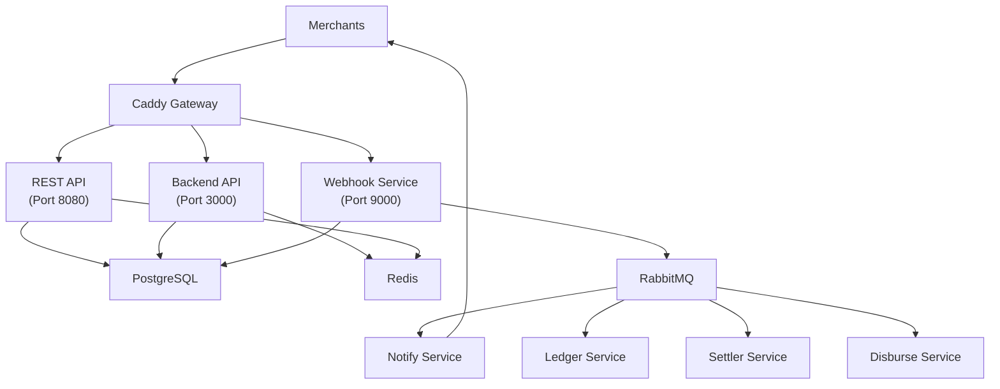

+++
draft = false
date = '2026-06-09T10:00:00+07:00'
title = 'Snapphi'
type = 'project'
description = 'A payment orchestration platform for the Indonesian market integration with Xendit, Midtrans, and Doku behind a single API with intelligent routing, automated settlement, and a multi-tenant admin dashboard.'
image = ''
repository = ''
languages = ['rust', 'typescript']
tools = ['axum', 'react', 'postgresql', 'rabbitmq', 'redis', 'docker']
+++

Integrating payment providers in Indonesia means dealing with fragmented APIs, inconsistent webhook formats, and manual reconciliation workflows. Each provider (Xendit, Midtrans, Doku) has its own authentication scheme, its own transaction lifecycle, and its own settlement process. A merchant wanting to accept QRIS, Virtual Accounts, and E-wallets needs to build and maintain three separate integrations, handle three different webhook payloads, and manually reconcile settlements across all of them.

Snapphi is a payment orchestration platform that aggregates these providers behind a single unified API. It handles the full payment lifecycle (transaction creation, provider routing, webhook processing, ledger accounting, daily settlement batching, and fund disbursement) through an event-driven architecture built in Rust with a React admin dashboard. One integration point for merchants, one dashboard for operators.

## Problem Background

- **Multiple providers, multiple integrations**: each provider has its own API contract, webhook format, and authentication mechanism. Merchants must build and maintain separate integrations for each, multiplying development and operational cost
- **No intelligent routing**: when a provider experiences downtime or rate limits, transactions fail. There is no automatic failover or load distribution across providers
- **Manual reconciliation**: tracking which transactions settled, computing fees, and maintaining accurate merchant balances requires manual processes prone to error and delay
- **Complex access control**: payment platforms serve both internal admins and external merchants, each requiring different permission levels. Role management needs to work at both system-wide and per-merchant scope

## Solution Overview

Snapphi abstracts provider complexity into three layers: a merchant-facing payment API that routes transactions to the best available provider, an async pipeline that processes webhooks and maintains financial records, and a multi-tenant dashboard that gives admins and merchants scoped visibility into their data.

The payment API exposes one endpoint per payment method. Behind it, using configurable routing strategies like failover, weighted by amount  and weighted by score, determine which provider handles each transaction. Webhooks trigger an asynchronous chain, status update, merchant notification, ledger entry, settlement batching, and disbursement. Every financial event produces an immutable ledger entry with before/after balances.

**Tech stack:** Rust (Axum, SQLx, Tokio, Lapin), React 19, TypeScript, PostgreSQL, Redis, RabbitMQ, Docker, Caddy

**My role:** Sole developer: system architecture, all backend services, frontend dashboard, database design, infrastructure, and deployment

## System Architecture

The system runs as 9 Rust binaries, each responsible for a single domain:

| Service        | Responsibility                                                                      |
| -------------- | ----------------------------------------------------------------------------------- |
| **restapi**    | Merchant-facing payment API: token generation, transaction creation               |
| **backend**    | Admin dashboard API: RBAC, merchant management, payment configuration, reporting  |
| **webhook**    | Ingests provider callbacks, updates transaction status, triggers the async pipeline |
| **notify**     | Delivers webhook callbacks to merchants' configured URLs                            |
| **ledger**     | Credits/debits merchant buckets, creates auditable ledger entries                   |
| **settler**    | Batches settled transactions into daily settlement records                          |
| **disburse**   | Processes fund disbursements to merchant bank accounts                              |
| **withdrawal** | Handles merchant withdrawal request processing                                      |
| **email**      | Sends transactional emails via Brevo                                                |

All services share a single Rust crate with domain modules, ensuring consistent types and business logic across the system. Services communicate through RabbitMQ queues, if the notification service is slow or temporarily down it does not block webhook processing or ledger updates.

## Key Features

- **Intelligent provider routing**: three strategies (failover, weighted by amount, weighted by score) determine how transactions are distributed across Xendit, Midtrans, and Doku. Each merchant can override default routing priorities and weights
- **Four payment methods**: QRIS, Virtual Accounts, E-wallets, and Disbursements, each routed through the provider selection layer
- **Event-driven transaction pipeline**: a single payment flows through 8 asynchronous stages from creation to settlement. Each step is idempotent, and messages wait in RabbitMQ if a downstream service is temporarily unavailable
- **Real-time financial ledger**: every payment, fee, settlement, and withdrawal produces an immutable ledger entry with amount, balance before, balance after, and source reference. Manual adjustments are supported with full audit trail
- **Multi-tenant RBAC**: permissions operate at two scopes: system (user, admin) and merchant (owner). System admins can dynamically create custom roles with custom permission sets for both scopes. Permissions are cached in Redis and take effect immediately on change, with no JWT re-issue needed
- **29-page admin dashboard**: transaction explorer with multi-filter search and CSV export, settlement management, withdrawal approval workflows, payment channel configuration, analytics with trend charts, and merchant onboarding
- **Google OAuth2 authentication**: login flow with JWT access tokens (15-minute expiry) and refresh tokens (7-day expiry), proactive frontend token refresh, and login notification emails

## Technical Challenges and Solutions

**Cursor-based pagination for payment data.** Offset-based pagination degrades on large tables and produces inconsistent results when transactions are being inserted concurrently. All list endpoints use cursor-based pagination instead, which provides stable performance regardless of table size and consistent results during concurrent writes, critical for a system where new transactions arrive continuously.

**Immediate permission revocation.** Embedding permissions in JWTs means a revoked user retains access until the token expires, which is unacceptable for a payment platform. Permissions are cached in Redis keyed by session and merchant context. When an admin changes a role's permissions or assigns a different role to a user, the Redis cache is updated and the next API call reflects the change immediately. The JWT payload carries only `sub` and `session`, keeping tokens minimal and permissions mutable.

**Event sourcing without the complexity.** Full event sourcing would add significant architectural overhead. Instead, a `transaction_events` table captures every status transition: from status, to status, event source, and raw provider payload. This provides complete auditability and debugging capability without event replay mechanics. When a transaction fails, the full history including the raw provider response is immediately available.

**Decoupled service communication.** Synchronous HTTP calls between services would create cascading failure risks, a slow notification service could back-pressure the webhook processor and drop incoming provider callbacks. RabbitMQ queues decouple each service. Messages are durable, and each service can be scaled, deployed, and debugged independently. The trade-off is eventual consistency, but for post-payment processing (notification, ledger, settlement), this is the correct model.

**Repository pattern for testable domain logic.** All database access goes through repository traits with PostgreSQL implementations injected at startup. This separates business logic from storage concerns, enabling unit testing without a database and making storage implementation swappable without touching domain code.

## Lessons Learned

**The adapter pattern is the right abstraction for multi-provider systems.** Each payment provider has fundamentally different API semantics, but the domain operations (create transaction, check status, process refund) are the same. Defining provider adapters behind a common trait made adding Doku support a matter of implementing the trait, not modifying the routing or pipeline logic.

**Redis-cached permissions beat JWT-embedded permissions for dynamic access control.** The simplicity of self-contained JWTs is appealing, but a system where admins can create custom roles and modify permissions on the fly needs changes to take effect immediately. The Redis cache approach adds one network hop per request but ensures that role updates, permission changes, and revocations are reflected on the very next API call.

**Message queues turn a monolith into services without the distributed systems complexity.** RabbitMQ provided service decoupling without requiring service discovery, circuit breakers, or distributed tracing that a full microservices architecture demands. Each service reads from a queue, does its work, and publishes to the next. The operational model is closer to a pipeline than a mesh.

**Rust's type system catches payment bugs at compile time.** In a payment system, confusing a gross amount with a net amount or a merchant ID with a transaction ID can cause real financial damage. Rust's strong typing (newtypes for domain identifiers, enums for transaction states, exhaustive pattern matching for status transitions) moved an entire class of bugs from runtime to compile time.

## Conclusion

Snapphi demonstrates that a single developer can build a production-grade payment orchestration platform when the architecture is right. Rust provides the performance and safety guarantees that financial systems demand, while an event-driven pipeline keeps services decoupled and independently deployable.

The system processes transactions across three providers, maintains real-time ledger balances, batches daily settlements, and serves a 29-page admin dashboard, all from 9 Rust binaries and 14 Docker containers orchestrated behind Caddy. A live demo is available at [snapphi.mnabila.com](https://snapphi.mnabila.com).
